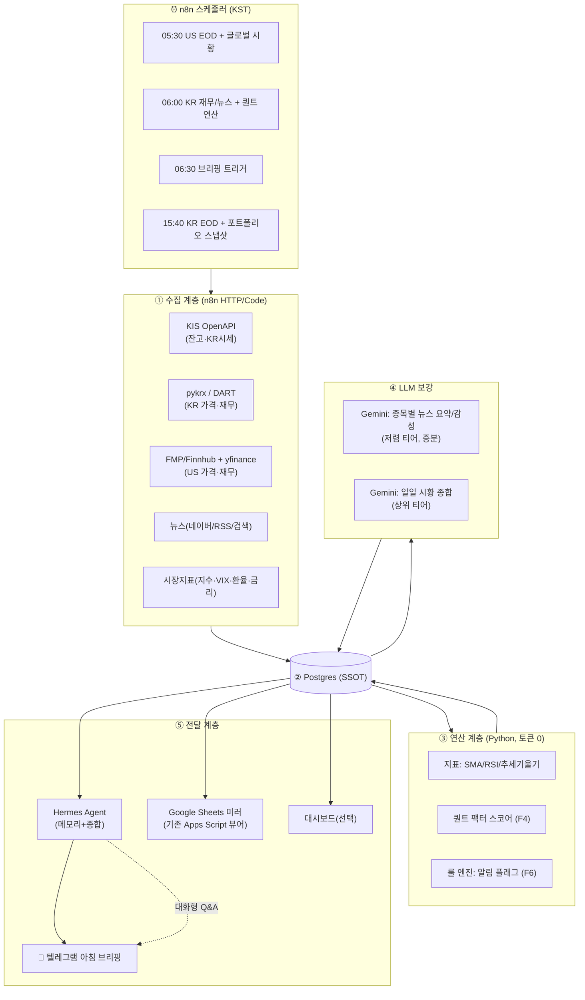

# PRD — 개인 투자 인텔리전스 에이전트 (코드네임: ATLAS)

> **이 문서는 시스템의 단일 진실 공급원(SSOT)이다.** 데이터 스키마·JSON 계약·역할 분담은 모두 여기 §5, §7을 기준으로 한다.
> 함께 쓰는 문서: `CLAUDE.md`(Claude Code 작업 지침), `prompts/GEMINI_PROMPT.md`(Gemini 런타임 프롬프트), `prompts/HERMES_PROMPT.md`(Hermes Agent 프롬프트).

| 항목 | 값 |
|---|---|
| 버전 | v1.2 |
| 작성일 | 2026-06-08 |
| PM | Claude (대화 세션) |
| 빌더 | Claude Code |
| 런타임 LLM | Gemini (정량 보조), Hermes Agent (오케스트레이션·전달) |
| 상태 | 설계 확정 대기 (§12 미해결 질문 답변 필요) |

---

## ⚠️ 0. 면책 (모든 산출물에 적용)

이 시스템은 **정보 수집·정리·정량 분석 도구**다. 매수/매도 지시나 투자 자문이 아니다. 모든 점수·플래그·요약은 참고용이며, 투자 판단과 그 결과의 책임은 전적으로 사용자에게 있다. 텔레그램 브리핑을 포함한 모든 출력에는 "투자 자문 아님 / 원금 손실 가능" 문구를 노출한다. **v1 범위는 읽기 전용(조회)이며, 자동 주문/체결은 범위에서 제외한다.**

---

## 1. 배경 & 기존 시스템 진단

사용자는 GitHub Actions(`main.py`)와 Google Sheets로 관심종목 정보를 수집·정리해 왔다. 현재 "데이터 수집이 어렵고 분석 오류가 계속 발생"하는 상태다. 기존 코드를 검토한 결과, 오류의 원인은 일시적 버그가 아니라 **구조적 문제**다.

### 1.1 기존 자산
- **`main.py`** — 34개 종목(미국+한국)에 대해 yfinance로 모멘텀(SMA/RSI/정배열)·재무·밸류에이션·애널리스트 데이터를 모으고, Yahoo + DuckDuckGo(DDGS) 뉴스를 Gemini 2.5 Flash로 감성 분석한 뒤 `gspread`로 시트를 `clear()` 후 통째로 덮어쓴다.
- **`auto_run.yml`** — 매일 21:00 UTC(=06:00 KST) 1회 실행.
- **Apps Script(`code.gs` + `ReportModal.html`)** — 대시보드 A1/B1 셀의 티커로 TradingView 차트 사이드바와 리포트(구글 문서/PDF) 모달을 띄우는 **뷰어**. 데이터 백본이 아니라 표시 계층이다.

### 1.2 근본 원인 (왜 분석 오류가 나는가)
1. **Google Sheets를 DB이자 연산 계층으로 사용** → `worksheet.clear()` 직후 전체 업로드 구조라서, 수집 중 한 종목이라도 실패하면 직전 데이터가 통째로 날아가고 이력이 없다. 동시성·재시도·검증이 불가능.
2. **한국 종목(`.KS`)에 yfinance 의존** → KR 재무/컨센서스/목표가가 비거나 부정확(`N/A` 대량 발생). 이게 "분석 오류"의 핵심 체감 원인.
3. **취약한 스크래핑(DDGS)** → DuckDuckGo 뉴스 API가 버전마다 바뀌고(코드에도 `ddgs v6+ API 변경 대응` 주석 존재) 레이트리밋에 막힘.
4. **모놀리식 단일 스크립트** → 수집·연산·LLM·업로드가 한 파일에 묶여 있어, 한 곳이 깨지면 전체가 멈춘다. 계층 격리·멱등성·부분 재시도가 없다.
5. **스키마/검증 부재 + 모델 하드코딩** → LLM 출력이 스키마를 벗어나도 잡지 못하고, 모델명이 코드에 박혀 있다.

### 1.3 설계 원칙 (재발 방지)
- **계층 분리 & 멱등성**: 수집 → 원천 저장 → 연산 → LLM 보강 → 표시. 각 계층은 독립적으로 재실행 가능하고, 한 종목 실패가 전체를 막지 않는다(per-ticker try/except + 상태기록).
- **DB가 SSOT, 시트는 뷰**: 데이터는 Postgres에 적재. Google Sheets는 선택적 읽기 전용 미러(기존 Apps Script 뷰어 유지용).
- **KR/US 데이터 소스 분리**: 시장별로 신뢰 가능한 소스를 쓴다(§F2).
- **결정론은 코드로, 언어는 LLM으로**: 지표·점수 계산은 Python(토큰 0). LLM은 자연어(뉴스 요약·시황 서술)만.
- **모든 LLM I/O는 JSON 스키마로 계약**(§5.3).
- **관측 가능성**: 모든 실행은 `runs` 테이블에 성공/실패/에러를 남긴다.

---

## 2. 목표 / 비목표 / 성공 지표

### 2.1 목표
사용자의 6개 요구를 기능(F1~F6)으로 매핑한다.

| 요구 | 기능 ID | 요약 |
|---|---|---|
| ① KB 계좌 연동 실시간 현황 | **F1** | 보유종목·평가손익·현금 스냅샷 (읽기 전용) |
| ② 관심종목 정량 일일 업데이트 | **F2** | 뉴스·주가흐름·매력도·컨센서스·매출 등 |
| ③ 시장 상황 업데이트 | **F3** | 지수·금리·환율·VIX + 시황 서술 |
| ④ 퀀트 관점 피드백 알고리즘 | **F4** | 팩터 스코어링(투명·규칙기반) |
| ⑤ 매일 아침 텔레그램 브리핑 | **F5** | Hermes가 종합 → 텔레그램 발송 |
| ⑥ 그 외 투자 도움 기능 | **F6** | 알림·실적 캘린더·리스크·백테스트 등 |

### 2.2 비목표 (v1 제외)
- 자동 주문/체결(매매 실행) — 안전·리스크상 제외.
- 개인화된 "사라/팔아라" 추천 — 자문 아님.
- 실시간 틱 데이터/HFT — 일/분 단위로 충분.

### 2.3 성공 지표
- 일일 파이프라인 성공률 ≥ 99%(부분 실패 허용·자동 복구).
- KR 종목 핵심 지표(가격·재무·컨센서스) 결측률 < 5% (현재 대비 대폭 개선).
- 아침 브리핑이 매일 정시(±5분)에 1회 도착.
- LLM 비용: 종목당 일일 토큰 사용량이 기존 대비 감소(캐싱·증분 요약·티어링).

---

## 3. 시스템 아키텍처

### 3.1 구성요소 역할 요약
- **n8n** — 결정론적 워크플로 엔진. 스케줄링, API 호출, 레이트리밋, DB 적재, 텔레그램 트리거. "LLM 밖에서 처리할 수 있는 모든 로직"을 여기서 처리(토큰 절약).
- **Postgres (Supabase 무료 티어 권장)** — SSOT. n8n·Hermes·대시보드가 공유. (단일 PC 전용이면 SQLite로 대체 가능.)
- **Python 분석 모듈** (`/src`) — 지표·팩터 점수 등 결정론적 연산. n8n의 Code/Execute Command 노드 또는 컨테이너로 호출.
- **Gemini** — 런타임 자연어 보강(뉴스 요약·시황 서술). 대량은 저렴 티어, 종합은 상위 티어.
- **Hermes Agent** — 영속 메모리 + 스케줄 + 텔레그램 네이티브 연동. 아침 브리핑 종합·발송, 사용자와의 대화형 후속(보유종목 Q&A), 시간에 따른 컨텍스트 유지.
- **Claude Code** — 빌드 타임 엔지니어. Python 모듈/ n8n 워크플로 JSON / Hermes 스킬 작성·리팩터링·테스트.
- **Claude (이 세션) = PM** — 아키텍처·계약·수용 기준·진행 관리.

### 3.2 아키텍처 다이어그램



### 3.3 데이터 흐름 원칙
- 수집 계층은 **원천 데이터만** DB에 저장(가공 전). 연산/LLM이 깨져도 원천은 보존된다.
- 연산·LLM 결과는 별도 테이블에 `asof_date`와 함께 누적 → **이력 추적 가능**(기존 `clear()` 문제 해결).
- Hermes·시트·대시보드는 모두 DB를 읽기만 한다(쓰기는 n8n/연산 계층만).

---

## 4. 일일 운영 타임라인 (KST)

미국장 마감(써머타임 기준 약 05:00) 직후부터 한국장 개장(09:00) 전까지가 브리핑 골든타임.

| 시각(KST) | 트리거 | 작업 |
|---|---|---|
| **05:30** | n8n Cron | US EOD 시세·재무 갱신, 글로벌 지수/금리/환율/VIX 수집 → DB |
| **06:00** | n8n Cron | KR 재무(DART)·뉴스 갱신 → 지표·퀀트 점수 연산 → **변경분만** Gemini 뉴스 요약 → DB |
| **06:15** | n8n | Gemini 일일 시황 종합(상위 티어 1회) → DB `market_daily.summary_md` |
| **06:30** | n8n → Hermes | Hermes가 DB에서 당일 데이터 + 메모리 결합 → 브리핑 생성 → 📲 텔레그램 발송 |
| **장중(선택, P2)** | n8n 30분 간격 | 룰 엔진 알림(과열/데드크로스 임박/목표가 괴리/실적 D-3) → 텔레그램 |
| **15:40** | n8n Cron | KR EOD 시세 + **KIS 보유잔고 스냅샷**(F1) → DB |

> 기존 `auto_run.yml`의 06:00 KST 1회 실행은 위 06:00 슬롯으로 흡수된다. GitHub Actions는 n8n로 이전하되, n8n 호스팅이 어려우면 **과도기에는 Actions 유지**도 가능(§9).

---

## 5. 데이터 모델 & 계약 (SSOT)

### 5.1 Postgres 스키마 (DDL 스케치)
```sql
-- 관심종목
CREATE TABLE watchlist (
  ticker      TEXT PRIMARY KEY,        -- 'AAPL', '035420.KS'
  name        TEXT NOT NULL,
  market      TEXT NOT NULL,           -- 'US' | 'KR'
  sector      TEXT,
  is_holding  BOOLEAN DEFAULT FALSE,
  active      BOOLEAN DEFAULT TRUE,
  added_at    TIMESTAMPTZ DEFAULT now()
);

-- 일별 가격(원천 OHLCV만 저장, 지표는 연산 계층/뷰에서)
CREATE TABLE prices_daily (
  ticker TEXT, date DATE, open NUMERIC, high NUMERIC, low NUMERIC,
  close NUMERIC, volume BIGINT, source TEXT, fetched_at TIMESTAMPTZ DEFAULT now(),
  PRIMARY KEY (ticker, date)
);

-- 연산된 기술적 지표 (이력 누적)
CREATE TABLE indicators_daily (
  ticker TEXT, date DATE, sma20 NUMERIC, sma50 NUMERIC, sma200 NUMERIC,
  rsi14 NUMERIC, disparity20 NUMERIC, slope50 NUMERIC, slope200 NUMERIC,
  is_aligned BOOLEAN, PRIMARY KEY (ticker, date)
);

-- 재무 (연간/분기)
CREATE TABLE fundamentals (
  ticker TEXT, period_type TEXT, period_end DATE,
  revenue NUMERIC, op_income NUMERIC, op_margin NUMERIC, net_income NUMERIC,
  source TEXT, PRIMARY KEY (ticker, period_type, period_end)
);

-- 밸류에이션/퀄리티 스냅샷
CREATE TABLE valuation (
  ticker TEXT, asof DATE, per_t NUMERIC, per_f NUMERIC, pbr NUMERIC,
  ev_ebitda NUMERIC, roe NUMERIC, roa NUMERIC, debt_ratio NUMERIC,
  rev_growth NUMERIC, PRIMARY KEY (ticker, asof)
);

-- 애널리스트 컨센서스
CREATE TABLE analyst (
  ticker TEXT, asof DATE, rating TEXT, target_price NUMERIC,
  upside NUMERIC, n_analysts INT, PRIMARY KEY (ticker, asof)
);

-- 뉴스 원천 (URL 해시로 dedupe)
CREATE TABLE news_raw (
  id BIGSERIAL PRIMARY KEY, ticker TEXT, source TEXT, published_at TIMESTAMPTZ,
  title TEXT, body TEXT, url TEXT, url_hash TEXT UNIQUE, fetched_at TIMESTAMPTZ DEFAULT now()
);

-- 뉴스 LLM 분석 (이력 누적) ── Gemini 출력 §5.3-A 저장
CREATE TABLE news_analysis (
  ticker TEXT, asof DATE, sentiment TEXT, sentiment_score NUMERIC,
  summary_md TEXT, payload JSONB, n_articles INT, model TEXT, based_on TEXT,
  PRIMARY KEY (ticker, asof)
);

-- 퀀트 점수 (이력 누적) ── §F4
CREATE TABLE quant_scores (
  ticker TEXT, asof DATE, momentum NUMERIC, value NUMERIC, quality NUMERIC,
  growth NUMERIC, sentiment NUMERIC, composite NUMERIC, flags JSONB,
  PRIMARY KEY (ticker, asof)
);

-- 포트폴리오 (F1)
CREATE TABLE portfolio (
  ticker TEXT, qty NUMERIC, avg_price NUMERIC, cur_price NUMERIC,
  eval_amount NUMERIC, pnl NUMERIC, pnl_pct NUMERIC, asof TIMESTAMPTZ,
  PRIMARY KEY (ticker, asof)
);
CREATE TABLE portfolio_snapshot (
  asof TIMESTAMPTZ PRIMARY KEY, total_value NUMERIC, total_cost NUMERIC,
  total_pnl NUMERIC, cash NUMERIC, payload JSONB
);

-- 시장 (F3)
CREATE TABLE market_daily (
  asof DATE PRIMARY KEY, kospi NUMERIC, kosdaq NUMERIC, sp500 NUMERIC,
  nasdaq NUMERIC, vix NUMERIC, usdkrw NUMERIC, ust10y NUMERIC,
  summary_md TEXT, payload JSONB
);

-- 관측: 실행 로그
CREATE TABLE runs (
  run_id BIGSERIAL PRIMARY KEY, kind TEXT, started_at TIMESTAMPTZ,
  finished_at TIMESTAMPTZ, status TEXT, errors JSONB
);
```

### 5.2 종목 일일 레코드 (Hermes·시트 소비용 뷰)
연산이 끝나면 종목별로 아래 형태의 객체를 만들 수 있어야 한다(뷰 또는 조립 함수).
```json
{
  "ticker": "035420.KS", "name": "네이버", "market": "KR",
  "price": {"close": 218000, "chg_pct": 1.2, "rsi14": 58.3, "disparity20": 101.4, "is_aligned": true},
  "fundamentals": {"rev_yoy": 0.11, "op_margin": 0.19, "last_q_rev_b": 2.7},
  "valuation": {"per_f": 18.2, "pbr": 1.3, "roe": 0.09},
  "analyst": {"rating": "BUY", "target": 260000, "upside": 0.19},
  "news": {"sentiment": "긍정", "score": 0.4, "summary_md": "- ...", "based_on": "recent"},
  "quant": {"composite": 71, "momentum": 78, "value": 55, "quality": 64, "growth": 70, "sentiment": 66,
            "flags": ["RSI 모멘텀 양호", "밸류에이션 부담 없음"]},
  "is_holding": true
}
```

### 5.3 LLM 입출력 계약 (스키마 고정)
LLM은 **반드시 아래 JSON만** 반환한다. 상세 프롬프트는 `prompts/GEMINI_PROMPT.md`.

**A) 종목 뉴스 요약 (Gemini, 종목당)**
```json
{
  "sentiment": "긍정|중립|부정",
  "sentiment_score": 0.0,
  "key_points": ["불릿1", "불릿2"],
  "catalysts": [{"date": "YYYY-MM-DD", "headline": "...", "impact": "긍정|부정", "importance": "상|중|하"}],
  "risks": ["..."],
  "summary_md": "- ...\n- ...",
  "confidence": "상|중|하",
  "based_on": "recent|fallback_old"
}
```

**B) 일일 시황 종합 (Gemini, 1회/일)**
```json
{
  "regime": "위험선호|중립|위험회피",
  "headline": "한 줄 요약",
  "drivers": ["오늘 시장을 움직인 요인1", "..."],
  "kr_us_note": "한·미 시장 온도차 코멘트",
  "watch_today": ["오늘 체크포인트1", "..."],
  "summary_md": "- ..."
}
```

**C) 아침 브리핑 (Hermes 생성, 자연어 + 정형 헤더)** — 템플릿은 `prompts/HERMES_PROMPT.md` §브리핑.

---

## 6. 기능 요구사항 상세

### F1 — 계좌 연동 실시간 현황 (읽기 전용) ⚠️ 최우선 미해결
**문제**: KB증권/국민은행 자체 오픈API는 법인·제휴(핀테크스토어·BaaS) 중심으로 확인됨. 개인이 *자기 계좌*를 자가발급 키로 프로그래밍 조회하는 표준 경로는 불확실하다.

**의사결정 트리 (사용자 선택 필요):**
- **옵션 A (권장·데이터 신뢰성 최고)**: **한국투자증권 KIS Developers OpenAPI**. 앱키 무료 발급, REST(`국내주식 잔고조회`·시세), 공식 GitHub에 LLM 친화 샘플·백테스터 제공. 데이터 조회 목적의 보조 계좌로 많이 활용됨. → v1 기본 경로로 채택.
- **옵션 B (KB 고수 시)**: KB증권 핀테크스토어/KB API 포탈에 **개인이 본인 계좌 API 키를 발급받을 수 있는지 고객센터에 직접 확인**. 리테일에는 미제공일 가능성이 높음. 가능하면 KIS 자리에 KB 커넥터를 끼우는 방식으로 교체.
- **옵션 C (오픈뱅킹)**: 금융결제원 오픈뱅킹은 잔액/거래내역을 주지만 *이용기관 등록*(법인)이 필요하고 예금계좌 중심이라 증권 평가금액엔 부적합. 개인에겐 비현실적.
- **옵션 D (즉시 가능·과도기)**: KB MTS에서 보유내역 CSV/스크린샷을 주기적으로 내보내 시트/DB에 업로드(반자동). "실시간"은 아니지만 오늘 당장 동작.
- **옵션 E (비권장)**: 로그인 화면 스크래핑/브라우저 자동화 — 약관·보안 리스크로 권장하지 않음.

**산출**: `portfolio` / `portfolio_snapshot` 적재 → 브리핑 상단에 총평가·총손익·종목별 손익 표시.
**보안 원칙**: 모든 키/시크릿은 n8n Credentials 또는 환경변수로만 보관, 코드/문서/시트에 평문 금지. **자동 주문은 v1 제외.**

### F2 — 관심종목 정량 일일 업데이트
**소스(시장별 분리, 이게 핵심 개선):**
- **US**: 가격은 yfinance(폴백) + FMP/Finnhub/Alpha Vantage 중 1개(키 무료 티어), 재무·컨센서스는 FMP/Finnhub.
- **KR**: 가격/거래량은 **pykrx**(KRX), 재무·공시는 **DART OpenAPI**(무료), 시세·일부 컨센서스는 **KIS**, 컨센서스/목표가는 네이버금융/에프앤가이드 보조. → yfinance KR 의존 제거.
**산출 항목**(기존 `main.py` 컬럼 계승 + 정비): 현재가·등락률, SMA20/50/200·RSI14·이격도·추세기울기·정배열, 최근 1~3년·1~3분기 매출/영업이익률, PER(T/F)·PBR·EV/EBITDA·ROE·ROA·부채비율·매출성장률, 컨센서스(의견·목표가·상승여력), 뉴스 감성·요약.
**증분 처리**: `news_raw`에 새 기사(URL 해시 신규)가 있는 종목만 Gemini 재요약 → 토큰 절약.

### F3 — 시장 상황 업데이트
**수집**: KOSPI/KOSDAQ, S&P500/나스닥, VIX, USD/KRW, 미 국채 10년물, (옵션) 섹터 ETF·DXY·WTI. → `market_daily`.
**서술**: Gemini가 §5.3-B 스키마로 "오늘의 레짐 + 드라이버 + 한·미 온도차 + 체크포인트"를 1회 생성.

### F4 — 퀀트 팩터 스코어링 (투명·규칙기반, 결정론)
**LLM 아님. `src/compute_quant.py`에서 순수 Python/pandas/numpy로 계산.** 유니버스 전체 백분위(0~100) 정규화 후 레짐 가중합으로 composite. **점수는 설명용이며 매수/매도 신호가 아님.**

---

#### F4-1. 레짐 감지 (`compute_regime`)

yfinance로 KOSPI(`^KS11`), S&P500(`^GSPC`), VIX(`^VIX`), USD/KRW(`KRW=X`) 약 504일(2년) 일봉 수집 후 아래 3개 신호로 레짐 판정:

| 신호 | 조건 | 상수 |
|---|---|---|
| `sma200_bull` | KOSPI > KOSPI SMA(200) **AND** S&P500 > SP500 SMA(200) | — |
| `bear_24m` | ln(KOSPI_t / KOSPI_t-504) < 0 | 504 영업일 |
| `vix_spike` | VIX_t > VIX SMA(20) × 1.15 | `VIX_SPIKE_MULT = 1.15` |

판정 우선순위:
1. `bear_24m OR vix_spike` → **bear**
2. `sma200_bull AND NOT bear_24m AND NOT vix_spike` → **bull**
3. 그 외 (데이터 부족 포함) → **neutral**

> `krw_spike` (USD/KRW > SMA(20) × 1.03) 도 계산하나, 현재 레짐 판정 조건에는 직접 반영하지 않음.

---

#### F4-2. 사전 필터 (`is_filtered`)

아래 조건 중 하나라도 해당하면 `composite = None` 저장, "사전필터 제외" flag 추가:
- **Piotroski F-Score ≤ 3** (부실 기업 제외)
- **KR 종목 AND 고유변동성 > 유니버스 P80** (급등락 노이즈 제외)

**Piotroski F-Score** (최대 7점 실질, 0~9 표기): 수익성(op_income>0, ROA>0, op_margin>0, op_margin개선) + 재무건전성(debt_ratio감소, rev_growth>0, 발행주식수는 데이터 없어 0점) + 운영효율(revenue성장, gross_margin은 데이터 없어 0점). 데이터 없으면 중간값 4 + flag.

**고유변동성**: 60일 일별 수익률과 KOSPI 수익률의 OLS 잔차 표준편차(순수 numpy). KOSPI 정렬 불가 시 단순 표준편차 사용.

---

#### F4-3. 레짐별 동적 가중치

| 레짐 | Momentum | Value | Quality | Growth | Sentiment |
|---|---|---|---|---|---|
| **bull** | **0.45** | 0.20 | 0.20 | 0.10 | 0.05 |
| **neutral** | 0.35 | 0.25 | 0.25 | 0.10 | 0.05 |
| **bear** | 0.10 | 0.35 | **0.45** | 0.05 | 0.05 |

모든 가중치 합계 = 1.00. `composite = Σ(weight_k × score_k)`.

---

#### F4-4. 팩터 계산 요약

**Momentum (0~100)**

다중 시계열 로그수익률 Z-score 가중합 `F_mom`:

| 구간 | 계산 | Z-score 가중치 |
|---|---|---|
| 1개월 | ln(P_t / P_t-21) | 0.10 |
| 3개월 | ln(P_t-5 / P_t-63) | 0.20 |
| 6개월 | ln(P_t-21 / P_t-126) | 0.30 |
| **12-1M** | ln(P_t-21 / P_t-252) | **0.40** |

> 12-1 모멘텀(최근 1개월 skip): 단기 되돌림 효과 제거. 가격 데이터 252일 미만 시 있는 만큼 사용 + "데이터 부족" flag.

거래량 확인 모멘텀(VCM): 높은 모멘텀이지만 거래량이 낮은 종목을 선호(군집 매매 회피).
`VCM = rank(M_12M) × (1 − rank(turnover_126d))`

최종: `pct_rank(0.7 × F_mom + 0.3 × VCM)` → 0~100.

**Value (0~100)**

`v1 = pct_rank(1/PER_f)`, `v2 = pct_rank(1/PBR)`, `v3 = pct_rank(1/EV_EBITDA)`. PER_f 없으면 PER_t 폴백. 결측 항목 → 50 + flag. `Value = (v1 + v2 + v3) / 3`.

**Quality (0~100)**

`q = (pct_rank(ROE) + pct_rank(ROA) + pct_rank(op_margin) + (100 - pct_rank(debt_ratio))) / 4`. `Quality = 0.6 × q + 0.4 × pct_rank(F-Score)`.

**Growth (0~100)**

`g1 = pct_rank(rev_growth)`, `g2 = pct_rank(op_income YoY 변화율)`. 컨센서스 방향 `g3`: 목표가 21일 전 대비 상향이면 100, 하향이면 0, 레코드 없으면 upside > 10% → 70, 그 외 40. `Growth = 0.4×g1 + 0.4×g2 + 0.2×g3`.

**Sentiment (0~100)**

`news_analysis.sentiment_score`의 유니버스 내 백분위. 데이터 없으면 50.

---

#### F4-5. 결측 처리

데이터 없는 종목·팩터 → **50(중립)** + `flags`에 "데이터 부족" 기록 → N/A 전파 차단. 필터 제외 종목은 `composite = None` 저장.

### F5 — 매일 아침 텔레그램 브리핑
**생성·발송 주체: Hermes Agent**(텔레그램 네이티브). DB에서 당일 `portfolio_snapshot`·`quant_scores`·`news_analysis`·`market_daily`를 읽고, Hermes 메모리(보유 이력·관심 변화·이전 브리핑)와 결합해 종합. 템플릿·페르소나는 `prompts/HERMES_PROMPT.md`.
**구성**: ① 시장 한 줄 + 레짐 ② 내 포트폴리오 손익 요약 ③ 관심종목 퀀트 점수 상·하위 + 변동 ④ 오늘의 알림 플래그 ⑤ 주목 뉴스 3건 ⑥ 면책 1줄.
**대안 경로**: Hermes 운영이 부담이면 n8n Telegram 노드로 직접 발송 가능(이 경우 종합 텍스트는 Gemini가 생성, 메모리 기능은 포기).

### F6 — 추가 기능 (우선순위순)
1. **룰 기반 알림**: RSI 과열/침체, 골든·데드크로스 임박, 목표가 대비 괴리 임계 돌파, 급등락(거래량 동반). (Python 룰 엔진, 토큰 0)
2. **실적 캘린더**: 관심종목 어닝 D-3/D-day 알림(FMP/DART 일정).
3. **포트폴리오 리스크 요약**: 섹터·통화·종목 집중도, 보유 vs 관심 괴리.
4. **대화형 Q&A(Hermes)**: "네이버 왜 빠졌어?", "내 포트 중 밸류 점수 낮은 거?" → DB+메모리로 답변.
5. **백테스트(P3)**: 퀀트 점수 상위 N 종목의 과거 성과 검증(KIS backtester 또는 자체).
6. **리포트 뷰어 연계**: 기존 Apps Script 모달/`리포트DB`를 DB의 `report_url` 컬럼과 연동해 유지.
7. **대시보드 (Streamlit, `dashboard/app.py`)**: 텔레그램 브리핑을 보완하는 시각 표시 계층.
   - **목적**: 관심종목 퀀트 점수·시장 상황·뉴스 감성을 한 화면에서 탐색(표 정렬·필터·종목 드릴다운). 브리핑이 "푸시 요약"이라면 대시보드는 "풀(pull) 탐색".
   - **데이터 소스**: `assemble_daily(conn)`(§5.2 레코드) + `market_daily` + `prices_daily`(드릴다운 차트). **읽기 전용** — DB에 쓰지 않는다.
   - **표시 원칙**: composite·팩터·플래그 등 **점수와 사실만**. 매수/매도 표현 금지, 하단 면책 고정. 결측은 "—"/"필터제외"로(N/A 금지).
   - **로컬 우선**: `streamlit run dashboard/app.py`. 접속정보는 `DB_*` 환경변수 또는 `.streamlit/secrets.toml`. 배포는 추후(공개 배포 시 DB 비밀번호·보유종목 등 개인정보 노출 주의).

---

## 7. 멀티 AI 역할 분담 & 협업 모델

### 7.1 RACI (누가 무엇을)
| 작업 | PM(이 Claude) | Claude Code | Gemini | Hermes |
|---|---|---|---|---|
| PRD·계약·수용기준 | **A/R** | C | – | – |
| Python 모듈 구현/리팩터 | A | **R** | (코드리뷰 보조) | – |
| n8n 워크플로 JSON | A | **R** | – | C |
| 퀀트 점수 알고리즘 코드 | A | **R** | – | – |
| 런타임 뉴스 요약/시황 | C | (도구 작성) | **R** | – |
| 오케스트레이션·메모리·브리핑 발송 | C | (스킬 작성) | – | **R** |
| 대화형 Q&A | – | (스킬 작성) | – | **R** |
| 진행 점검·통합 검수 | **A/R** | C | – | – |

(R=실행, A=책임, C=자문) — **A는 항상 PM**이 보유하고, 실제 산출(R)은 도구별로 분담.

### 7.2 협업의 핵심: "계약이 인터페이스다"
세 AI는 서로 직접 대화하지 않는다. **DB 스키마(§5.1)와 JSON 계약(§5.3)이 유일한 접점**이다.
- Claude Code는 계약을 만족하는 코드를 짠다 → Gemini는 계약 스키마로만 출력 → Hermes는 계약 객체(§5.2)만 읽는다.
- 이렇게 하면 한 AI를 교체/수정해도 나머지가 안 깨진다. **토큰 효율의 핵심**이기도 하다(각 AI는 자기 일에 필요한 컨텍스트만 받음).

### 7.3 토큰/비용 예산 전략
- **결정론은 코드로**: 지표·퀀트 점수·룰 알림 = LLM 토큰 0.
- **Gemini 티어링**: 종목별 뉴스 요약 = `gemini-2.5-flash-lite` 또는 `gemini-3-flash`(대량·저렴), 일일 시황 종합 = `gemini-3.5-flash`(상위 1회). 입력은 dedupe·상위 N건·길이 제한.
- **증분 요약**: 새 뉴스 없는 종목은 전일 요약 재사용.
- **Hermes 비용 0 옵션**: 로컬 모델(Ollama/vLLM, `--tool-call-parser hermes`)로 오케스트레이션/브리핑 서술 → API 토큰 0. 단, 툴콜 신뢰성 확보를 위해 툴콜 지원이 검증된 모델 사용(소형 모델은 n8n 에이전트에서 툴콜이 문자열로 새는 사례 있음).
- **Claude Code/PM은 런타임 비용 아님**(빌드·관리 단계에만 사용).

### 7.4 진행 관리 (PM 루프)
- 작업은 §11 로드맵의 Phase/Task 체크리스트로 추적.
- 사용자는 각 도구 산출물(코드 PR, 워크플로, 프롬프트 결과)을 이 세션(PM)에 보고 → PM이 계약 위반·누락·통합 이슈를 점검하고 다음 작업 지시.
- 변경 시 PRD를 갱신하고 버전을 올린다(이 문서가 SSOT).

---

## 8. 기술 스택 (제안)
- 워크플로: **n8n**(self-host: Docker, 또는 n8n Cloud)
- DB: **Postgres**(Supabase 무료) / 대안 SQLite
- 언어/연산: **Python 3.12**, pandas, pandas-ta, pydantic(스키마 검증)
- 데이터: KIS OpenAPI, pykrx, DART OpenAPI, FMP/Finnhub, yfinance(폴백)
- LLM: Gemini API(티어링), Hermes Agent(로컬/클라우드)
- 전달: 텔레그램 봇(Hermes 또는 n8n 노드)
- 표시(선택): 기존 Google Apps Script 뷰어 + Sheets 미러

---

## 9. 마이그레이션 계획 (기존 → 신규)
| 기존 | 처리 |
|---|---|
| `main.py` 모놀리식 | `/src` 모듈로 분해: `ingest_us.py`, `ingest_kr.py`, `ingest_news.py`, `ingest_market.py`, `compute_indicators.py`, `compute_quant.py`, `rules.py`, `db.py`, `schemas.py`(pydantic). 기존 `get_momentum_data`/`get_fundamental_data` 로직은 `compute_indicators.py`로 이식·정비. |
| yfinance KR 의존 | KR은 pykrx+DART+KIS로 교체, yfinance는 US 폴백으로 강등. |
| DDGS 뉴스 | 네이버 뉴스/RSS + 검색 API로 교체, dedupe(`url_hash`). |
| Sheets `clear()`+덮어쓰기 | Postgres 적재로 교체. Sheets는 DB→시트 미러(읽기 전용). |
| `auto_run.yml`(Actions) | n8n 스케줄로 이전. **과도기엔 Actions로 `/src` 실행 유지 가능**(점진 전환). |
| Apps Script 뷰어 | 유지. `리포트DB`를 DB `report_url`과 동기화. |

---

## 10. 리스크 & 의존성
- **(상) KB API 개인 접근 불확실** → §F1 의사결정. 최악의 경우 옵션 D(반자동)로 시작.
- **(중) KR 컨센서스/목표가 데이터 확보** → 무료 소스 한계. 네이버/에프앤가이드 보조, 없으면 해당 팩터 중립 처리.
- **(중) 로컬 모델 툴콜 신뢰성** → 검증된 모델·파서 사용, 핵심 호출은 클라우드로.
- **(중) 무료 데이터 레이트리밋** → n8n에서 배치·캐시·간격 제어.
- **(저) 자문 규제 리스크** → 출력은 정보·정량 분석에 한정, 면책 상시 노출, 자동매매 제외.

---

## 11. 로드맵 (Phase / Task 체크리스트)

### Phase 0 — 기반 (1주)
- [ ] §12 미해결 질문 확정(특히 F1 옵션, n8n 호스팅, Postgres vs SQLite)
- [x] DB 생성 + 스키마 적용(§5.1) — `db/schema.sql` 완료
- [x] 리포지토리 재구성 + `CLAUDE.md` 반영 → **Claude Code**
- [ ] KIS/Gemini/텔레그램/DART 키 발급 + n8n Credentials 등록

### Phase 1 — 데이터 백본 ✅ 완료
- [x] `schemas.py` + `db.py` — pydantic v2 계약 모델, upsert 헬퍼, log_run
- [x] `ingest_us.py` — yfinance 가격·재무·밸류에이션·애널리스트
- [x] `ingest_kr.py` — pykrx(가격) + dart-fss(DART 재무)
- [x] `ingest_news.py` — 네이버 HTML 스크래핑(KR) + yfinance.news(US), DDGS 제거, url_hash dedupe
- [x] `ingest_market.py` — ^KS11·^KQ11·^GSPC·^IXIC·^VIX·KRW=X·^TNX
- [x] `compute_indicators.py` — SMA20/50/200·RSI14·이격도·추세기울기·정배열 + 단위 테스트 20개
- [ ] n8n 수집 워크플로(05:30/06:00/15:40) → **Claude Code(JSON) + 사용자 임포트**
- [ ] 검수: KR 결측률·이력 누적 확인 → **PM**

### Phase 2 — 인텔리전스 (핵심 완료)
- [x] `compute_quant.py` — F4 팩터 스코어링(레짐감지·사전필터·5팩터) + 단위 테스트 35개
- [x] `rules.py` — 8개 룰 기반 알림 엔진 + 단위 테스트 64개
- [x] `enrich_gemini.py` — Gemini 뉴스 요약·시황 종합, 증분 처리, pydantic 검증 + 단위 테스트 46개
- [x] `assemble.py` — §5.2 StockDailyRecord 조립 뷰 + 단위 테스트 26개
- [ ] `ingest_portfolio.py` — F1 포트폴리오 스냅샷(F1 옵션 확정 후)
- [ ] 검수: 스키마 준수·증분 처리·토큰 사용량 → **PM**

### Phase 3 — 전달 & 확장
- [x] `run_pipeline.py` + `send_telegram.py` + `auto_run.yml`(06:00 KST) — 일일 실행·브리핑(Python 템플릿)
- [x] **대시보드** `dashboard/app.py`(Streamlit, F6-7) — 표·필터·드릴다운, 로컬 우선
- [x] `backfill.py`(가격 2년치) + `recompute.py`(지표·퀀트 재계산) + `recompute.yml`(수동 트리거)
- [ ] Hermes 브리핑 스킬(현재 Python 템플릿 → Hermes 전환), 대화형 Q&A(F6-4)
- [ ] 실적 캘린더·리스크 요약(F6), Sheets 미러 + 뷰어 연계
- [ ] (P3) 백테스트 → **Claude Code**

### 안정화 (운영 중 발견·수정)
- [x] **Decimal/DB 경계 버그**: psycopg3 NUMERIC→Decimal이 float·np.log·나눗셈에 섞여 indicators/quant 0건 → `db.get_conn` float 로더 + 읽기 경계 방어 캐스팅으로 수정
- [x] **저장 경로**: 단일 트랜잭션 1회 커밋 → 단계별 commit/rollback으로 전환(앞 단계 오류·연결 끊김이 저장 무효화하던 문제)
- [x] **assemble 타임아웃**: 종목별 루프 쿼리 → 테이블별 bulk 쿼리(연결 점유 분→초)
- [x] **KR DART**: `find_by_stock_code` 단일 Corp 인덱싱 버그 수정, 실패 시 None 유지 + `runs.errors` 기록

---

## 12. 미해결 질문 (사용자 답변 필요)
1. **F1 경로**: KIS 보조계좌 개설(옵션 A) OK? 아니면 KB 고수(옵션 B 확인 필요) / 반자동(옵션 D)?
2. **n8n 호스팅**: self-host(Docker) vs n8n Cloud? 상시 켜둘 서버/PC가 있는가?
3. **DB**: Postgres(Supabase) vs SQLite(단일 PC)?
4. **Hermes 실행 환경**: 로컬 GPU(VRAM?) 가능한가, 아니면 클라우드 모델 라우팅?
5. **관심종목 유니버스**: 기존 34종목 유지? 추가/삭제?
6. **컨센서스 데이터**: 유료 소스(FMP 등) 결제 의향이 있는가, 무료만?
7. **알림 채널**: 텔레그램 단일? 장중 알림(P2)도 원하는가?

---
*변경 이력:*
- *v1.0 (2026-06-08) 초안 작성 — PM(Claude).*
- *v1.1 (2026-06-09) §F4 실제 구현 내용으로 전면 교체(레짐감지·사전필터·동적가중치·VCM·12-1M), §11 로드맵 Phase 1·2 완료 항목 표시 — PM(Claude).*
- *v1.2 (2026-06-11) §F6에 대시보드(Streamlit) 추가, §11에 Decimal 경계 수정·대시보드·recompute·안정화 항목 반영 — PM(Claude).*
