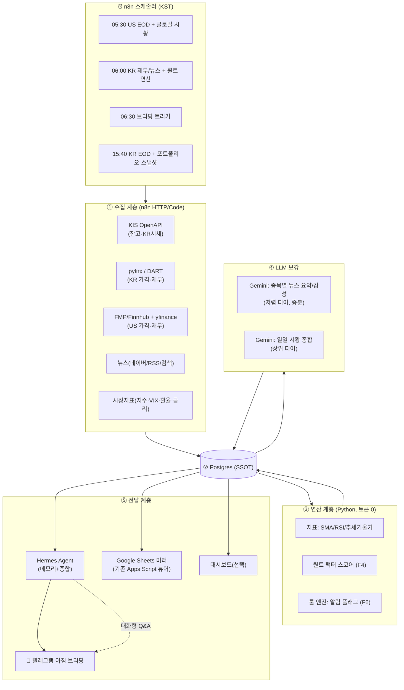

# PRD — 개인 투자 인텔리전스 에이전트 (코드네임: ATLAS)

> **이 문서는 시스템의 단일 진실 공급원(SSOT)이다.** 데이터 스키마·JSON 계약·역할 분담은 모두 여기 §5, §7을 기준으로 한다.
> 함께 쓰는 문서: `CLAUDE.md`(Claude Code 작업 지침), `prompts/GEMINI_PROMPT.md`(Gemini 런타임 프롬프트), `prompts/HERMES_PROMPT.md`(Hermes Agent 프롬프트).

| 항목 | 값 |
|---|---|
| 버전 | v3.8 |
| 작성일 | 2026-06-20 |
| PM | Claude (대화 세션) |
| 빌더 | Claude Code |
| 런타임 LLM | Gemini (정량 보조), Hermes Agent (오케스트레이션·전달) |
| 상태 | 설계 확정 대기 (§12 미해결 질문 답변 필요) |

---

## 0. 운영 정책 (모든 산출물에 적용)

이 시스템은 정보 수집·정리·정량 분석 도구다. 근거·신뢰도를 동반한 매수/관망/축소 표시 신호를 허용한다. 신호는 화면과 메시지 표시 전용이며, 주문·체결·이체와 외부 주문 API 호출은 범위에서 제외한다.

---

## 1. 배경 & 기존 시스템 진단

사용자는 GitHub Actions(`main.py`)와 Google Sheets로 관심종목 정보를 수집·정리해 왔다. 현재 "데이터 수집이 어렵고 분석 오류가 계속 발생"하는 상태다. 기존 코드를 검토한 결과, 오류의 원인은 일시적 버그가 아니라 **구조적 문제**다.

### 1.1 기존 자산
- **`main.py`** — 34개 종목(미국+한국)에 대해 yfinance로 모멘텀(SMA/RSI/정배열)·재무·밸류에이션·애널리스트 데이터를 모으고, Yahoo + DuckDuckGo(DDGS) 뉴스를 Gemini 2.5 Flash로 감성 분석한 뒤 `gspread`로 시트를 `clear()` 후 통째로 덮어쓴다.
- **`auto_run.yml`** — 매일 21:00 UTC(=06:00 KST) 1회 실행.
- **Apps Script(`code.gs` + `ReportModal.html`)** — 대시보드 A1/B1 셀의 티커로 TradingView 차트 사이드바와 리포트(구글 문서/PDF) 모달을 띄우는 **뷰어**. 데이터 백본이 아니라 표시 계층이다.

### 1.2 근본 원인 (왜 분석 오류가 나는가)
1. **Google Sheets를 DB이자 연산 계층으로 사용** → `worksheet.clear()` 직후 전체 업로드 구조라서, 수집 중 한 종목이라도 실패하면 직전 데이터가 통째로 날아가고 이력이 없다. 동시성·재시도·검증이 불가능.
2. **한국 종목(`.KS`)에 yfinance 의존** → KR 재무/컨센서스/목표가가 비거나 부정확(`N/A` 대량 발생). 이게 "분석 오류"의 핵심 체감 원인.
3. **취약한 스크래핑(DDGS)** → DuckDuckGo 뉴스 API가 버전마다 바뀌고(코드에도 `ddgs v6+ API 변경 대응` 주석 존재) 레이트리밋에 막힘.
4. **모놀리식 단일 스크립트** → 수집·연산·LLM·업로드가 한 파일에 묶여 있어, 한 곳이 깨지면 전체가 멈춘다. 계층 격리·멱등성·부분 재시도가 없다.
5. **스키마/검증 부재 + 모델 하드코딩** → LLM 출력이 스키마를 벗어나도 잡지 못하고, 모델명이 코드에 박혀 있다.

### 1.3 설계 원칙 (재발 방지)
- **계층 분리 & 멱등성**: 수집 → 원천 저장 → 연산 → LLM 보강 → 표시. 각 계층은 독립적으로 재실행 가능하고, 한 종목 실패가 전체를 막지 않는다(per-ticker try/except + 상태기록).
- **DB가 SSOT, 시트는 뷰**: 데이터는 Postgres에 적재. Google Sheets는 선택적 읽기 전용 미러(기존 Apps Script 뷰어 유지용).
- **KR/US 데이터 소스 분리**: 시장별로 신뢰 가능한 소스를 쓴다(§F2).
- **결정론은 코드로, 언어는 LLM으로**: 지표·점수 계산은 Python(토큰 0). LLM은 자연어(뉴스 요약·시황 서술)만.
- **모든 LLM I/O는 JSON 스키마로 계약**(§5.3).
- **관측 가능성**: 모든 실행은 `runs` 테이블에 성공/실패/에러를 남긴다.

---

## 2. 목표 / 비목표 / 성공 지표

### 2.1 목표
사용자의 6개 요구를 기능(F1~F6)으로 매핑한다.

| 요구 | 기능 ID | 요약 |
|---|---|---|
| ① KB 계좌 연동 실시간 현황 | **F1** | 보유종목·평가손익·현금 스냅샷 → **수동 입력 구현 완료** (portfolio_holdings + local_api + Portfolio 탭) |
| ② 관심종목 정량 일일 업데이트 | **F2** | 뉴스·주가흐름·매력도·컨센서스·매출 등 |
| ③ 시장 상황 업데이트 | **F3** | 지수·금리·환율·VIX + 시황 서술 |
| ④ 퀀트 관점 피드백 알고리즘 | **F4** | 팩터 스코어링(투명·규칙기반) |
| ⑤ 매일 아침 텔레그램 브리핑 | **F5** | Hermes가 종합 → 텔레그램 발송 |
| ⑥ 그 외 투자 도움 기능 | **F6** | 알림·실적 캘린더·리스크·백테스트 등 |

### 2.2 비목표 (v1 제외)
- 자동 주문/체결(매매 실행) — 안전·리스크상 제외.
- 자동 주문으로 이어지는 개인화 실행 경로.
- 실시간 틱 데이터/HFT — 일/분 단위로 충분.

### 2.3 성공 지표
- 일일 파이프라인 성공률 ≥ 99%(부분 실패 허용·자동 복구).
- KR 종목 핵심 지표(가격·재무·컨센서스) 결측률 < 5% (현재 대비 대폭 개선).
- 아침 브리핑이 매일 정시(±5분)에 1회 도착.
- LLM 비용: 종목당 일일 토큰 사용량이 기존 대비 감소(캐싱·증분 요약·티어링).

---

## 3. 시스템 아키텍처

### 3.1 구성요소 역할 요약
- **n8n** — 결정론적 워크플로 엔진. 스케줄링, API 호출, 레이트리밋, DB 적재, 텔레그램 트리거. "LLM 밖에서 처리할 수 있는 모든 로직"을 여기서 처리(토큰 절약).
- **Postgres (Supabase 무료 티어 권장)** — SSOT. n8n·Hermes·대시보드가 공유. (단일 PC 전용이면 SQLite로 대체 가능.)
- **Python 분석 모듈** (`/src`) — 지표·팩터 점수 등 결정론적 연산. n8n의 Code/Execute Command 노드 또는 컨테이너로 호출.
- **Gemini** — 런타임 자연어 보강(뉴스 요약·시황 서술). 대량은 저렴 티어, 종합은 상위 티어.
- **Hermes Agent** — 영속 메모리 + 스케줄 + 텔레그램 네이티브 연동. 아침 브리핑 종합·발송, 사용자와의 대화형 후속(보유종목 Q&A), 시간에 따른 컨텍스트 유지.
- **Claude Code** — 빌드 타임 엔지니어. Python 모듈/ n8n 워크플로 JSON / Hermes 스킬 작성·리팩터링·테스트.
- **Claude (이 세션) = PM** — 아키텍처·계약·수용 기준·진행 관리.

### 3.2 아키텍처 다이어그램



### 3.3 데이터 흐름 원칙
- 수집 계층은 **원천 데이터만** DB에 저장(가공 전). 연산/LLM이 깨져도 원천은 보존된다.
- 연산·LLM 결과는 별도 테이블에 `asof_date`와 함께 누적 → **이력 추적 가능**(기존 `clear()` 문제 해결).
- Hermes·시트·대시보드는 모두 DB를 읽기만 한다(쓰기는 n8n/연산 계층만).

---

## 4. 일일 운영 타임라인 (KST)

미국장 마감(써머타임 기준 약 05:00) 직후부터 한국장 개장(09:00) 전까지가 브리핑 골든타임.

| 시각(KST) | 트리거 | 작업 |
|---|---|---|
| **05:30** | n8n Cron | US EOD 시세·재무 갱신, 글로벌 지수/금리/환율/VIX 수집 → DB |
| **06:00** | n8n Cron | KR 재무(DART)·뉴스 갱신 → 지표·퀀트 점수 연산 → **변경분만** Gemini 뉴스 요약 → DB |
| **06:15** | n8n | Gemini 일일 시황 종합(상위 티어 1회) → DB `market_daily.summary_md` |
| **06:30** | n8n → Hermes | Hermes가 DB에서 당일 데이터 + 메모리 결합 → 브리핑 생성 → 📲 텔레그램 발송 |
| **장중(선택, P2)** | n8n 30분 간격 | 룰 엔진 알림(과열/데드크로스 임박/목표가 괴리/실적 D-3) → 텔레그램 |
| **15:40** | n8n Cron | KR EOD 시세 + **KIS 보유잔고 스냅샷**(F1) → DB |

> 기존 `auto_run.yml`의 06:00 KST 1회 실행은 위 06:00 슬롯으로 흡수된다. GitHub Actions는 n8n로 이전하되, n8n 호스팅이 어려우면 **과도기에는 Actions 유지**도 가능(§9).

---

## 5. 데이터 모델 & 계약 (SSOT)

### 5.1 Postgres 스키마 (DDL 스케치)
```sql
-- 관심종목
CREATE TABLE watchlist (
  ticker      TEXT PRIMARY KEY,        -- 'AAPL', '035420.KS'
  name        TEXT NOT NULL,
  market      TEXT NOT NULL,           -- 'US' | 'KR'
  sector      TEXT,
  is_holding  BOOLEAN DEFAULT FALSE,
  active      BOOLEAN DEFAULT TRUE,
  added_at    TIMESTAMPTZ DEFAULT now()
);

-- 일별 가격(원천 OHLCV만 저장, 지표는 연산 계층/뷰에서)
CREATE TABLE prices_daily (
  ticker TEXT, date DATE, open NUMERIC, high NUMERIC, low NUMERIC,
  close NUMERIC, volume BIGINT, source TEXT, fetched_at TIMESTAMPTZ DEFAULT now(),
  PRIMARY KEY (ticker, date)
);

-- 연산된 기술적 지표 (이력 누적)
CREATE TABLE indicators_daily (
  ticker TEXT, date DATE, sma20 NUMERIC, sma50 NUMERIC, sma200 NUMERIC,
  rsi14 NUMERIC, disparity20 NUMERIC, slope50 NUMERIC, slope200 NUMERIC,
  is_aligned BOOLEAN, PRIMARY KEY (ticker, date)
);

-- 재무 (연간/분기)
CREATE TABLE fundamentals (
  ticker TEXT, period_type TEXT, period_end DATE,
  revenue NUMERIC, op_income NUMERIC, op_margin NUMERIC, net_income NUMERIC,
  ocf NUMERIC, fcf NUMERIC,   -- PR-2: 영업현금흐름·잉여현금흐름(재무 추이)
  source TEXT, PRIMARY KEY (ticker, period_type, period_end)
);

-- 밸류에이션/퀄리티 스냅샷
CREATE TABLE valuation (
  ticker TEXT, asof DATE, per_t NUMERIC, per_f NUMERIC, pbr NUMERIC,
  ev_ebitda NUMERIC, roe NUMERIC, roa NUMERIC, debt_ratio NUMERIC,
  rev_growth NUMERIC, PRIMARY KEY (ticker, asof)
);

-- 애널리스트 컨센서스
CREATE TABLE analyst (
  ticker TEXT, asof DATE, rating TEXT, rating_label TEXT, rating_score NUMERIC,
  target_price NUMERIC, upside NUMERIC, eps_fwd NUMERIC, n_analysts INT,
  source TEXT, created_at TIMESTAMPTZ DEFAULT now(), PRIMARY KEY (ticker, asof)
);

CREATE TABLE analyst_views (
  ticker TEXT, asof DATE, stance TEXT, point TEXT, source TEXT,
  source_url TEXT, created_at TIMESTAMPTZ DEFAULT now(),
  UNIQUE (ticker, asof, stance, point, source, source_url)
);

-- 뉴스 원천 (URL 해시로 dedupe)
CREATE TABLE news_raw (
  id BIGSERIAL PRIMARY KEY, ticker TEXT, source TEXT, published_at TIMESTAMPTZ,
  title TEXT, body TEXT, url TEXT, url_hash TEXT UNIQUE, fetched_at TIMESTAMPTZ DEFAULT now()
);

-- 뉴스 LLM 분석 (이력 누적) ── Gemini 출력 §5.3-A 저장
CREATE TABLE news_analysis (
  ticker TEXT, asof DATE, sentiment TEXT, sentiment_score NUMERIC,
  summary_md TEXT, payload JSONB, n_articles INT, model TEXT, based_on TEXT,
  curated JSONB DEFAULT '[]',  -- PR: 중요뉴스 큐레이션 [{title,url,source,published_at,category,direction,impact_score,insight}]
  PRIMARY KEY (ticker, asof)
);

-- 퀀트 점수 (이력 누적) ── §F4
CREATE TABLE quant_scores (
  ticker TEXT, asof DATE, momentum NUMERIC, value NUMERIC, quality NUMERIC,
  growth NUMERIC, sentiment NUMERIC, composite NUMERIC,
  fscore SMALLINT,   -- PR-1: Piotroski F-Score(0~9, 실질 0~7) — 스크리너 안전마진 입력
  flags JSONB, PRIMARY KEY (ticker, asof)
);

-- 포트폴리오 (F1)
CREATE TABLE portfolio (
  ticker TEXT, qty NUMERIC, avg_price NUMERIC, cur_price NUMERIC,
  eval_amount NUMERIC, pnl NUMERIC, pnl_pct NUMERIC, asof TIMESTAMPTZ,
  PRIMARY KEY (ticker, asof)
);
CREATE TABLE portfolio_snapshot (
  asof TIMESTAMPTZ PRIMARY KEY, total_value NUMERIC, total_cost NUMERIC,
  total_pnl NUMERIC, cash NUMERIC, payload JSONB
);

-- 시장 (F3)
CREATE TABLE market_daily (
  asof DATE PRIMARY KEY, kospi NUMERIC, kosdaq NUMERIC, sp500 NUMERIC,
  nasdaq NUMERIC, vix NUMERIC, usdkrw NUMERIC, ust10y NUMERIC,
  summary_md TEXT, payload JSONB
);

-- 장기 벤치마크 이력 (W3-A, true backtest 비교용)
CREATE TABLE index_daily (
  index_code TEXT, asof DATE, close NUMERIC, source TEXT,
  PRIMARY KEY (index_code, asof)
);

-- 종목 핵심 동인 (Wave 4-C)
CREATE TABLE ticker_drivers (
  ticker TEXT, driver_code TEXT, driver_name TEXT, driver_source TEXT,
  weight SMALLINT, origin TEXT, rationale TEXT,
  created_at TIMESTAMPTZ DEFAULT now(), updated_at TIMESTAMPTZ DEFAULT now(),
  PRIMARY KEY (ticker, driver_code)
);
CREATE TABLE driver_prices (
  driver_code TEXT, asof DATE, close NUMERIC, source TEXT,
  PRIMARY KEY (driver_code, asof)
);

-- 종목별 누적 인사이트 (최근 뉴스/리포트/드라이버/거시 근거 영속화)
CREATE TABLE ticker_context (
  id BIGSERIAL PRIMARY KEY, ticker TEXT NOT NULL, context_type TEXT NOT NULL,
  content TEXT NOT NULL, source TEXT NOT NULL,
  valid_from DATE NOT NULL, valid_until DATE, created_at TIMESTAMPTZ DEFAULT now()
);

-- 관측: 실행 로그
CREATE TABLE runs (
  run_id BIGSERIAL PRIMARY KEY, kind TEXT, started_at TIMESTAMPTZ,
  finished_at TIMESTAMPTZ, status TEXT, errors JSONB
);

-- 사용자의 최신 판단과 누적 이력
CREATE TABLE stock_notes (
  ticker TEXT PRIMARY KEY, horizon TEXT, attractiveness INT,
  thesis TEXT, updated_at TIMESTAMPTZ DEFAULT now()
);
CREATE TABLE stock_note_history (
  id BIGSERIAL PRIMARY KEY, ticker TEXT NOT NULL, horizon TEXT,
  attractiveness INT, thesis TEXT NOT NULL, created_at TIMESTAMPTZ DEFAULT now()
);

-- 포트폴리오 전략 조언(CoT 결과 캐시). cache_key=보유·현금·레짐 시그니처 → 변경 시 stale.
CREATE TABLE portfolio_advice (
  cache_key TEXT PRIMARY KEY, payload JSONB NOT NULL,
  generated_at TIMESTAMPTZ NOT NULL DEFAULT now()
);

-- 전략 비교 결과 (Wave 3)
CREATE TABLE backtest_results (
  id BIGSERIAL PRIMARY KEY,
  strategy TEXT, track TEXT, horizon TEXT,
  cum_return NUMERIC, cagr NUMERIC, mdd NUMERIC, sharpe NUMERIC,
  regime_returns JSONB, payload JSONB, computed_at TIMESTAMPTZ DEFAULT now()
);
```

### 5.2 종목 일일 레코드 (Hermes·시트 소비용 뷰)
연산이 끝나면 종목별로 아래 형태의 객체를 만들 수 있어야 한다(뷰 또는 조립 함수).
```json
{
  "ticker": "035420.KS", "name": "네이버", "market": "KR",
  "price": {"close": 218000, "chg_pct": 1.2, "rsi14": 58.3, "disparity20": 101.4, "is_aligned": true},
  "fundamentals": {"rev_yoy": 0.11, "op_margin": 0.19, "last_q_rev_b": 2.7},
  "valuation": {"per_f": 18.2, "pbr": 1.3, "roe": 0.09},
  "analyst": {"rating": "매수", "target": 260000, "upside": 0.19, "source": "naver+fnguide"},
  "news": {"sentiment": "긍정", "score": 0.4, "summary_md": "- ...", "based_on": "recent"},
  "quant": {"composite": 71, "momentum": 78, "value": 55, "quality": 64, "growth": 70, "sentiment": 66,
            "flags": ["RSI 모멘텀 양호", "밸류에이션 부담 없음"],
            "signal": {"label": "매수", "percentile": 82, "reason": "퀀트 종합 백분위 82위(상위 18%), 강점 팩터는 모멘텀 78점", "confidence": 70}},
  "is_holding": true
}
```

### 5.3 LLM 입출력 계약 (스키마 고정)
LLM은 **반드시 아래 JSON만** 반환한다. 상세 프롬프트는 `prompts/GEMINI_PROMPT.md`.

**A) 종목 뉴스 요약 (Gemini, 종목당)**
```json
{
  "sentiment": "긍정|중립|부정",
  "sentiment_score": 0.0,
  "key_points": ["불릿1", "불릿2"],
  "catalysts": [{"date": "YYYY-MM-DD", "headline": "...", "impact": "긍정|부정", "importance": "상|중|하"}],
  "risks": ["..."],
  "summary_md": "- ...\n- ...",
  "confidence": "상|중|하",
  "based_on": "recent|fallback_old"
}
```

**B) 일일 시황 종합 (Gemini, 1회/일)**
```json
{
  "regime": "위험선호|중립|위험회피",
  "headline": "한 줄 요약",
  "drivers": ["오늘 시장을 움직인 요인1", "..."],
  "kr_us_note": "한·미 시장 온도차 코멘트",
  "watch_today": ["오늘 체크포인트1", "..."],
  "summary_md": "- ..."
}
```

**C) 아침 브리핑 (Hermes 생성, 자연어 + 정형 헤더)** — 템플릿은 `prompts/HERMES_PROMPT.md` §브리핑.

---

## 6. 기능 요구사항 상세

### F1 — 계좌 연동 실시간 현황 (읽기 전용) ⚠️ 최우선 미해결
**문제**: KB증권/국민은행 자체 오픈API는 법인·제휴(핀테크스토어·BaaS) 중심으로 확인됨. 개인이 *자기 계좌*를 자가발급 키로 프로그래밍 조회하는 표준 경로는 불확실하다.

**의사결정 트리 (사용자 선택 필요):**
- **옵션 A (권장·데이터 신뢰성 최고)**: **한국투자증권 KIS Developers OpenAPI**. 앱키 무료 발급, REST(`국내주식 잔고조회`·시세), 공식 GitHub에 LLM 친화 샘플·백테스터 제공. 데이터 조회 목적의 보조 계좌로 많이 활용됨. → v1 기본 경로로 채택.
- **옵션 B (KB 고수 시)**: KB증권 핀테크스토어/KB API 포탈에 **개인이 본인 계좌 API 키를 발급받을 수 있는지 고객센터에 직접 확인**. 리테일에는 미제공일 가능성이 높음. 가능하면 KIS 자리에 KB 커넥터를 끼우는 방식으로 교체.
- **옵션 C (오픈뱅킹)**: 금융결제원 오픈뱅킹은 잔액/거래내역을 주지만 *이용기관 등록*(법인)이 필요하고 예금계좌 중심이라 증권 평가금액엔 부적합. 개인에겐 비현실적.
- **옵션 D (즉시 가능·과도기)**: KB MTS에서 보유내역 CSV/스크린샷을 주기적으로 내보내 시트/DB에 업로드(반자동). "실시간"은 아니지만 오늘 당장 동작.
- **옵션 E (비권장)**: 로그인 화면 스크래핑/브라우저 자동화 — 약관·보안 리스크로 권장하지 않음.

**산출**: `portfolio` / `portfolio_snapshot` 적재 → 브리핑 상단에 총평가·총손익·종목별 손익 표시.
**보안 원칙**: 모든 키/시크릿은 n8n Credentials 또는 환경변수로만 보관, 코드/문서/시트에 평문 금지. **자동 주문은 v1 제외.**

### F2 — 관심종목 정량 일일 업데이트
**소스(시장별 분리, 이게 핵심 개선):**
- **US**: 가격은 yfinance(폴백) + FMP/Finnhub/Alpha Vantage 중 1개(키 무료 티어), 재무·컨센서스는 FMP/Finnhub.
- **KR**: 가격/거래량은 **pykrx**(KRX), 재무·공시는 **DART OpenAPI**(무료). **밸류에이션(PER/PBR)·컨센서스(목표가·투자의견)·ROE·부채비율은 네이버금융 종목메인 + FnGuide Company Guide 무료 스크래핑**(계좌 불필요, `ingest_kr.fetch_kr_valuation_analyst`). **KIS Developers는 옵션**(환경변수 `KIS_APPKEY/KIS_APPSECRET` 있을 때만 활성, `ingest_kis.py` — ROE/부채/컨센서스 '있으면 우선' 보강). → **yfinance KR 사용 금지**(절대규칙).
- **애널리스트 컨센서스/논거 (Wave 4-D-1)**: 기존 `analyst` 경로를 정규 컨센서스 저장소로 재사용하고 `rating_label/rating_score/eps_fwd/source`를 함께 저장한다(중복 테이블 금지). 정성 논거는 `analyst_views`에 `stance='bull'|'bear'`로 분리 저장하며, Gemini는 `news_raw`·`news_analysis`·`ticker_context`를 읽어 **실제 기사에 인용된 애널리스트/증권사 코멘트만** 추출하고 `source_url`을 반드시 보존한다.
**산출 항목**(기존 `main.py` 컬럼 계승 + 정비): 현재가·등락률, SMA20/50/200·RSI14·이격도·추세기울기·정배열, 최근 1~3년·1~3분기 매출/영업이익률, PER(T/F)·PBR·EV/EBITDA·ROE·ROA·부채비율·매출성장률, 컨센서스(의견·목표가·상승여력), 뉴스 감성·요약.
**증분 처리**: `news_raw`에 새 기사(URL 해시 신규)가 있는 종목만 Gemini 재요약 → 토큰 절약.

### F3 — 시장 상황 업데이트
**수집**: KOSPI/KOSDAQ, S&P500/나스닥, VIX, USD/KRW, 미 국채 10년물, (옵션) 섹터 ETF·DXY·WTI. → `market_daily`.
**서술**: Gemini가 §5.3-B 스키마로 "오늘의 레짐 + 드라이버 + 한·미 온도차 + 체크포인트"를 1회 생성.

### F4 — 퀀트 팩터 스코어링 (투명·규칙기반, 결정론)
**LLM 아님. `src/compute_quant.py`에서 순수 Python/pandas/numpy로 계산.** 유니버스 전체 백분위(0~100) 정규화 후 국면 가중합으로 composite. 표시 신호도 결정론적 코드로 계산한다.

---

#### F4-1. 레짐 감지 (`compute_regime`)

yfinance로 KOSPI(`^KS11`), S&P500(`^GSPC`), VIX(`^VIX`), USD/KRW(`KRW=X`) 약 504일(2년) 일봉 수집 후 아래 3개 신호로 레짐 판정:

| 신호 | 조건 | 상수 |
|---|---|---|
| `sma200_bull` | KOSPI > KOSPI SMA(200) **AND** S&P500 > SP500 SMA(200) | — |
| `bear_24m` | ln(KOSPI_t / KOSPI_t-504) < 0 | 504 영업일 |
| `vix_spike` | VIX_t > VIX SMA(20) × 1.15 | `VIX_SPIKE_MULT = 1.15` |

판정 우선순위:
1. `bear_24m OR vix_spike` → **bear**
2. `sma200_bull AND NOT bear_24m AND NOT vix_spike` → **bull**
3. 그 외 (데이터 부족 포함) → **neutral**

> `krw_spike` (USD/KRW > SMA(20) × 1.03) 도 계산하나, 현재 레짐 판정 조건에는 직접 반영하지 않음.

---

#### F4-2. 사전 필터 (`is_filtered`)

아래 조건 중 하나라도 해당하면 `composite = None` 저장, "사전필터 제외" flag 추가:
- **Piotroski F-Score ≤ 3** (부실 기업 제외)
- **KR 종목 AND 고유변동성 > 유니버스 P80** (급등락 노이즈 제외)

**Piotroski F-Score** (최대 7점 실질, 0~9 표기): 수익성(op_income>0, ROA>0, op_margin>0, op_margin개선) + 재무건전성(debt_ratio감소, rev_growth>0, 발행주식수는 데이터 없어 0점) + 운영효율(revenue성장, gross_margin은 데이터 없어 0점). 데이터 없으면 중간값 4 + flag.

**고유변동성**: 60일 일별 수익률과 KOSPI 수익률의 OLS 잔차 표준편차(순수 numpy). KOSPI 정렬 불가 시 단순 표준편차 사용.

---

#### F4-3. 레짐별 동적 가중치

| 레짐 | Momentum | Value | Quality | Growth | Sentiment |
|---|---|---|---|---|---|
| **bull** | **0.45** | 0.20 | 0.20 | 0.10 | 0.05 |
| **neutral** | 0.35 | 0.25 | 0.25 | 0.10 | 0.05 |
| **bear** | 0.10 | 0.35 | **0.45** | 0.05 | 0.05 |

모든 가중치 합계 = 1.00. `composite = Σ(weight_k × score_k)`.

---

#### F4-4. 팩터 계산 요약

**Momentum (0~100)**

다중 시계열 로그수익률 Z-score 가중합 `F_mom`:

| 구간 | 계산 | Z-score 가중치 |
|---|---|---|
| 1개월 | ln(P_t / P_t-21) | 0.10 |
| 3개월 | ln(P_t-5 / P_t-63) | 0.20 |
| 6개월 | ln(P_t-21 / P_t-126) | 0.30 |
| **12-1M** | ln(P_t-21 / P_t-252) | **0.40** |

> 12-1 모멘텀(최근 1개월 skip): 단기 되돌림 효과 제거. 가격 데이터 252일 미만 시 있는 만큼 사용 + "데이터 부족" flag.

거래량 확인 모멘텀(VCM): 높은 모멘텀이지만 거래량이 낮은 종목을 선호(군집 매매 회피).
`VCM = rank(M_12M) × (1 − rank(turnover_126d))`

최종: `pct_rank(0.7 × F_mom + 0.3 × VCM)` → 0~100.

**Value (0~100)**

`v1 = pct_rank(1/PER_f)`, `v2 = pct_rank(1/PBR)`, `v3 = pct_rank(1/EV_EBITDA)`. PER_f 없으면 PER_t 폴백. 결측 항목 → 50 + flag. `Value = (v1 + v2 + v3) / 3`.

**Quality (0~100)**

`q = (pct_rank(ROE) + pct_rank(ROA) + pct_rank(op_margin) + (100 - pct_rank(debt_ratio))) / 4`. `Quality = 0.6 × q + 0.4 × pct_rank(F-Score)`.

**Growth (0~100)**

`g1 = pct_rank(rev_growth)`, `g2 = pct_rank(op_income YoY 변화율)`. 컨센서스 방향 `g3`: 목표가 21일 전 대비 상향이면 100, 하향이면 0, 레코드 없으면 upside > 10% → 70, 그 외 40. `Growth = 0.4×g1 + 0.4×g2 + 0.2×g3`.

**Sentiment (0~100)**

`news_analysis.sentiment_score`의 유니버스 내 백분위. 데이터 없으면 50.

---

#### F4-5. 결측 처리

데이터 없는 종목·팩터 → **50(중립)** + `flags`에 "데이터 부족" 기록 → N/A 전파 차단. 필터 제외 종목은 `composite = None` 저장.

#### F4-7. Wave 1 표시 신호

활성 종목 중 `composite`가 있는 종목의 횡단면 평균순위 백분위를 사용한다. 백분위 70 이상은 `매수`, 30 이하는 `축소`, 그 사이는 `관망`이다. 동점은 같은 백분위를 부여한다. 모든 신호는 `label`, `percentile`, 가장 높은 팩터를 포함한 `reason`, 경계 여유를 50~100으로 정규화한 `confidence`를 함께 표시한다. `composite`가 없으면 신호는 `null`이다. 신호는 표시 전용이며 주문 실행 경로가 없다.

> **KR 가치/퀄리티/성장은 이제 실제 값**(네이버+FnGuide로 PER/PBR/ROE/부채/목표가 수집, 2026-06-15). 결측인 종목만 중립(50) 유지. 검증: KR 11종목 전부 value/quality/growth가 50고정 → 실제 분포로 전환(예: 코웨이 V=77.6, KT&G V=62.7).

#### F4-6. 스크리너 '장기 보유 = 안전마진' (PR-1, 2026-06-16)

기존 단일 **Piotroski F-Score 7+** 필터는 신호 7·8(발행주식수·매출총이익률) 미수집으로 실질 만점이 7 → 7+가 구조적으로 0개(리스트 빔). **안전마진 복합점수**로 재정의:

`안전마진 = 0.40 × 가치(value 팩터) + 0.35 × 퀄리티(quality 팩터) + 0.25 × 재무건전성`.
**재무건전성** = F-Score 있으면 `F-Score/7×100`, 없으면 `ROE`·`debt_ratio` 대체(둘 다 0~100 정규화 평균). → **F-Score 결측 종목도 평가 가능**.
스크리너 장기보유 패널 = 안전마진 ≥ 55 종목을 점수 내림차순(상위 9), 각 종목에 가치/퀄리티/F-Score + "왜 후보인가" 근거 1줄(저PER·고ROE·저부채 등). 충족 0이면 "현재 기준 충족 종목 없음" 명시. F-Score는 `quant_scores.fscore`에 영속화(과거 export `fscore=None` 하드코딩 버그 동시 수정).

### F5 — 매일 아침 텔레그램 브리핑

> **⏸ 보류(비활성, 2026-06-16)**: 텔레그램 발송은 현재 끔. 코드(`send_telegram.py`)는 보존.
> **활성화 방법**: ① 환경변수 `TELEGRAM_ENABLED=true` + `TELEGRAM_BOT_TOKEN`/`TELEGRAM_CHAT_ID` 설정,
> ② `.github/workflows/auto_run.yml`의 '텔레그램 브리핑 발송' step 주석 해제(`TELEGRAM_ENABLED: "true"` 포함).
> 기본값(`TELEGRAM_ENABLED` 미설정)에서는 `run_send`가 발송하지 않고 no-op 성공 반환 → 에러 없음.

**생성·발송 주체: Hermes Agent**(텔레그램 네이티브). DB에서 당일 `portfolio_snapshot`·`quant_scores`·`news_analysis`·`market_daily`를 읽고, Hermes 메모리(보유 이력·관심 변화·이전 브리핑)와 결합해 종합. 템플릿·페르소나는 `prompts/HERMES_PROMPT.md`.
**구성**: ① 시장 한 줄 + 국면 ② 내 포트폴리오 손익 요약 ③ 관심종목 퀀트 점수·표시 신호·변동 ④ 오늘의 알림 플래그 ⑤ 주목 뉴스 3건.
**대안 경로**: Hermes 운영이 부담이면 n8n Telegram 노드로 직접 발송 가능(이 경우 종합 텍스트는 Gemini가 생성, 메모리 기능은 포기).

### F6 — 추가 기능 (우선순위순)
1. **룰 기반 알림**: RSI 과열/침체, 골든·데드크로스 임박, 목표가 대비 괴리 임계 돌파, 급등락(거래량 동반). (Python 룰 엔진, 토큰 0)
2. **실적 캘린더**: 관심종목 어닝 D-3/D-day 알림(FMP/DART 일정).
3. **포트폴리오 리스크 요약**: 섹터·통화·종목 집중도, 보유 vs 관심 괴리.
4. **대화형 Q&A(Hermes)**: "네이버 왜 빠졌어?", "내 포트 중 밸류 점수 낮은 거?" → DB+메모리로 답변.
5. **백테스트 ✅ 구현**: `src/backtest.py` — 모멘텀 진짜 백테스트 + 팩터별 회고(§F7 표준 원칙). 투자 판단 메모(horizon/매력도/논거)는 `stock_notes`.
6. **리포트 뷰어 연계**: 기존 Apps Script 모달/`리포트DB`를 DB의 `report_url` 컬럼과 연동해 유지.
7. **대시보드 (React/Vite, `dashboard-web/`)**: 텔레그램 브리핑을 보완하는 시각 표시 계층. ✅ v1.3 구현 완료.
   - **구현**: Vite + React (Pretendard·JetBrains Mono·Instrument Serif), `claude design` 프로토타입 pixel-perfect 포팅.
   - **탭**: 오버뷰(랭킹·알림·주목뉴스) · 종목상세(차트·팩터·지표) · 뉴스 · 스크리너 · 시장전망 · 리서치노트.
   - **데이터**: `src/export_dashboard_data.py` → `dashboard-web/src/data.json` → React 빌드타임 import. 없으면 mock fallback.
   - **개선**: 종목상세 "섹터 N개 중 순위" 텍스트, 스크리너 레짐 판정 근거 한 줄.
   - **표시 원칙**: composite·팩터·플래그와 근거·신뢰도를 동반한 신호를 표시한다. 단독 신호 라벨은 금지하며 결측은 null/None(N/A 금지).
   - **로컬 실행**: `cd dashboard-web && npm run dev` → http://localhost:5173.
   - **레거시**: `dashboard/app.py` (Streamlit) — 유지보수 안 함, 참조용으로만 보존.

### F7 — 전략 검증: "진짜 백테스트" vs "회고" (표준 원칙, 위반 금지)

전략 성과 비교는 두 개념을 **절대 혼동하지 않는다**. 어기는 화면·코드는 금지한다.

| 구분 | true_backtest (진짜 백테스트) | retrospective (회고) |
|---|---|---|
| 정의 | 각 과거 시점 t에서 **t까지의 데이터만**으로 선정·평가 (look-ahead 없음) | **오늘** 선정한 상위 종목의 **과거 수익률**을 되돌아봄 |
| 적용 팩터 | **모멘텀만** (가격 시계열로 과거 재현 가능) | 가치·퀄리티·성장·복합 (valuation/analyst가 오늘 스냅샷 1건뿐 → 과거 재현 불가) |
| 편향 | 없음(실제 운용 가능 성과 추정) | **선정시점편향(look-ahead/survivorship)** 존재 |
| 화면 표기 | "실제 백테스트" | **"참고용 · 백테스트 아님"** + 선정시점편향 경고 박스 필수 |

- 구현: `src/backtest.py` — true track(`momentum_12_1`, `low_vol`, `equal_weight_bh`)과 retrospective track(`value`, `quality`, `multifactor`)를 별도 계산한다. true는 월별 리밸런싱 point-in-time 전략이고, retrospective는 최신 스냅샷 상위 종목 고정 바스켓 회고다.
- 지표: 1Y/3Y/5Y 누적수익률·CAGR·MDD·Sharpe(rf=0). 결과는 `backtest_results`의 `(strategy, track, horizon)` 단위로 저장하고, `payload`에는 리베이스100 곡선·지수 비교선·선정 예시를 담는다.
- 벤치마크 백본(W3-A): true backtest 비교용 KOSPI/S&P500/NASDAQ 5년 일봉은 `index_daily`에 저장한다. `market_daily`는 최신 스냅샷/시황용으로 유지하고, 회고·백테스트 표시에서 장기 시계열과 혼용하지 않는다.
- 표시: React "전략 비교" 탭은 true / retrospective 섹션을 분리한다. 각 섹션은 전략별 1Y/3Y/5Y 표, 선택 전략 + KOSPI/S&P500/NASDAQ 리베이스100 차트, 국면별 성과 막대차트를 제공한다. retrospective 섹션은 상단 경고 배지를 고정 노출한다.
- 전략 제언(W3-C): 시장전망 탭의 "현재 국면 추천 전략"은 현재 레짐에서 강했던 true track 전략을 1차로 제언하고, retrospective는 참고용으로만 붙인다. 제언은 근거·신뢰도를 동반한 표시 전용이며 자동 주문 경로가 없다.
- **승격 경로(2026-06-15~)**: `valuation`/`analyst`를 매 실행 `asof=오늘`로 일자별 누적 저장(PK `(ticker, asof)`). 가치·퀄리티·성장 스냅샷 시계열이 수개월 쌓이면, 회고(retrospective)를 각 과거 시점의 실제 스냅샷으로 재현하는 **진짜 백테스트로 승격** 가능. 그 전까지는 회고로만 표기(선정시점편향 경고 유지).

---

## 7. 멀티 AI 역할 분담 & 협업 모델

### 7.1 RACI (누가 무엇을)
| 작업 | PM(이 Claude) | Claude Code | Gemini | Hermes |
|---|---|---|---|---|
| PRD·계약·수용기준 | **A/R** | C | – | – |
| Python 모듈 구현/리팩터 | A | **R** | (코드리뷰 보조) | – |
| n8n 워크플로 JSON | A | **R** | – | C |
| 퀀트 점수 알고리즘 코드 | A | **R** | – | – |
| 런타임 뉴스 요약/시황 | C | (도구 작성) | **R** | – |
| 오케스트레이션·메모리·브리핑 발송 | C | (스킬 작성) | – | **R** |
| 대화형 Q&A | – | (스킬 작성) | – | **R** |
| 진행 점검·통합 검수 | **A/R** | C | – | – |

(R=실행, A=책임, C=자문) — **A는 항상 PM**이 보유하고, 실제 산출(R)은 도구별로 분담.

### 7.2 협업의 핵심: "계약이 인터페이스다"
세 AI는 서로 직접 대화하지 않는다. **DB 스키마(§5.1)와 JSON 계약(§5.3)이 유일한 접점**이다.
- Claude Code는 계약을 만족하는 코드를 짠다 → Gemini는 계약 스키마로만 출력 → Hermes는 계약 객체(§5.2)만 읽는다.
- 이렇게 하면 한 AI를 교체/수정해도 나머지가 안 깨진다. **토큰 효율의 핵심**이기도 하다(각 AI는 자기 일에 필요한 컨텍스트만 받음).

### 7.3 토큰/비용 예산 전략
- **결정론은 코드로**: 지표·퀀트 점수·룰 알림 = LLM 토큰 0.
- **Gemini 티어링**: 종목별 뉴스 요약 = `gemini-2.5-flash-lite` 또는 `gemini-3-flash`(대량·저렴), 일일 시황 종합 = `gemini-3.5-flash`(상위 1회). 입력은 dedupe·상위 N건·길이 제한.
- **증분 요약**: 새 뉴스 없는 종목은 전일 요약 재사용.
- **Hermes 비용 0 옵션**: 로컬 모델(Ollama/vLLM, `--tool-call-parser hermes`)로 오케스트레이션/브리핑 서술 → API 토큰 0. 단, 툴콜 신뢰성 확보를 위해 툴콜 지원이 검증된 모델 사용(소형 모델은 n8n 에이전트에서 툴콜이 문자열로 새는 사례 있음).
- **Claude Code/PM은 런타임 비용 아님**(빌드·관리 단계에만 사용).

### 7.4 진행 관리 (PM 루프)
- 작업은 §11 로드맵의 Phase/Task 체크리스트로 추적.
- 사용자는 각 도구 산출물(코드 PR, 워크플로, 프롬프트 결과)을 이 세션(PM)에 보고 → PM이 계약 위반·누락·통합 이슈를 점검하고 다음 작업 지시.
- 변경 시 PRD를 갱신하고 버전을 올린다(이 문서가 SSOT).

---

## 8. 기술 스택 (제안)
- 워크플로: **n8n**(self-host: Docker, 또는 n8n Cloud)
- DB: **Postgres**(Supabase 무료) / 대안 SQLite
- 언어/연산: **Python 3.12**, pandas, pandas-ta, pydantic(스키마 검증)
- 데이터: KIS OpenAPI, pykrx, DART OpenAPI, FMP/Finnhub, yfinance(폴백)
- LLM: Gemini API(티어링), Hermes Agent(로컬/클라우드)
- 전달: 텔레그램 봇(Hermes 또는 n8n 노드)
- 표시(선택): 기존 Google Apps Script 뷰어 + Sheets 미러

---

## 9. 마이그레이션 계획 (기존 → 신규)
| 기존 | 처리 |
|---|---|
| `main.py` 모놀리식 | `/src` 모듈로 분해: `ingest_us.py`, `ingest_kr.py`, `ingest_news.py`, `ingest_market.py`, `compute_indicators.py`, `compute_quant.py`, `rules.py`, `db.py`, `schemas.py`(pydantic). 기존 `get_momentum_data`/`get_fundamental_data` 로직은 `compute_indicators.py`로 이식·정비. |
| yfinance KR 의존 | KR은 pykrx+DART+KIS로 교체, yfinance는 US 폴백으로 강등. |
| DDGS 뉴스 | 네이버 뉴스/RSS + 검색 API로 교체, dedupe(`url_hash`). |
| Sheets `clear()`+덮어쓰기 | Postgres 적재로 교체. Sheets는 DB→시트 미러(읽기 전용). |
| `auto_run.yml`(Actions) | n8n 스케줄로 이전. **과도기엔 Actions로 `/src` 실행 유지 가능**(점진 전환). |
| Apps Script 뷰어 | 유지. `리포트DB`를 DB `report_url`과 동기화. |

---

## 10. 리스크 & 의존성
- **(상) KB API 개인 접근 불확실** → §F1 의사결정. 최악의 경우 옵션 D(반자동)로 시작.
- **(중) KR 컨센서스/목표가 데이터 확보** → 무료 소스 한계. 네이버/에프앤가이드 보조, 없으면 해당 팩터 중립 처리.
- **(중) 로컬 모델 툴콜 신뢰성** → 검증된 모델·파서 사용, 핵심 호출은 클라우드로.
- **(중) 무료 데이터 레이트리밋** → n8n에서 배치·캐시·간격 제어.
- **(저) 신호 오해 리스크** → 모든 신호에 근거·신뢰도를 함께 표시하고 자동 주문 경로를 제외.

---

## 11. 로드맵 (Phase / Task 체크리스트)

### Phase 0 — 기반 (1주)
- [ ] §12 미해결 질문 확정(특히 F1 옵션, n8n 호스팅, Postgres vs SQLite)
- [x] DB 생성 + 스키마 적용(§5.1) — `db/schema.sql` 완료
- [x] 리포지토리 재구성 + `CLAUDE.md` 반영 → **Claude Code**
- [ ] KIS/Gemini/텔레그램/DART 키 발급 + n8n Credentials 등록

### Phase 1 — 데이터 백본 ✅ 완료
- [x] `schemas.py` + `db.py` — pydantic v2 계약 모델, upsert 헬퍼, log_run
- [x] `ingest_us.py` — yfinance 가격·재무·밸류에이션·애널리스트
- [x] `ingest_kr.py` — pykrx(가격) + dart-fss(DART 재무)
- [x] `ingest_news.py` — KR: 네이버 HTML + Google News RSS / US: yfinance.news + Yahoo RSS + Finnhub(옵션) + Google News RSS, `_MARKET_KR/US` 시황뉴스, DDGS 제거, url_hash dedupe
- [x] `ingest_market.py` — ^KS11·^KQ11·^GSPC·^IXIC·^VIX·KRW=X·^TNX
- [x] `compute_indicators.py` — SMA20/50/200·RSI14·이격도·추세기울기·정배열 + 단위 테스트 20개
- [ ] n8n 수집 워크플로(05:30/06:00/15:40) → **Claude Code(JSON) + 사용자 임포트**
- [ ] 검수: KR 결측률·이력 누적 확인 → **PM**

### Phase 2 — 인텔리전스 (핵심 완료)
- [x] `compute_quant.py` — F4 팩터 스코어링(레짐감지·사전필터·5팩터) + 단위 테스트 35개
- [x] `rules.py` — 8개 룰 기반 알림 엔진 + 단위 테스트 64개
- [x] `enrich_gemini.py` — Gemini 뉴스 요약·시황 종합, 증분 처리, pydantic 검증 + 단위 테스트 46개
- [x] `assemble.py` — §5.2 StockDailyRecord 조립 뷰 + 단위 테스트 26개
- [ ] `ingest_portfolio.py` — F1 포트폴리오 스냅샷(F1 옵션 확정 후)
- [ ] 검수: 스키마 준수·증분 처리·토큰 사용량 → **PM**

### Phase 3 — 전달 & 확장
- [x] `run_pipeline.py` + `send_telegram.py` + `auto_run.yml`(06:00 KST) — 일일 실행·브리핑(Python 템플릿)
- [x] **대시보드 (Streamlit)** `dashboard/app.py` — 레거시, 유지보수 안 함
- [x] **대시보드 (React)** `dashboard-web/` (Vite+React, F6-7) — pixel-perfect 디자인 포팅, data.json 연동, 섹터순위·레짐근거 개선 포함
- [x] **대시보드 UI 개선 PR-1~6** (2026-06-14):
  - PR-1: 종목상세 네비게이션 — 검색/자동완성 + 이전·다음 버튼 + 같은섹터 칩 (34개 풀리스트 제거)
  - PR-2: 지수 등락률 0.00% 버그 수정 (`prev_distinct`로 실제 변동 행 탐색) + 시장 코멘트 카드
  - PR-3: 알림 분리 — 액션 신호/데이터 품질 분류, 품질 항목 접힘 섹션 (export에 flagsAction/flagsQuality)
  - PR-4: 가격차트 거래량 바 추가 + SMA60/120 범례 클릭 토글 (volumeSeries·sma60Series 등 export)
  - PR-5: `dashboard/watchlist_admin.py` — SQL 없이 watchlist 추가·비활성화·보유토글
  - PR-6: 종목상세 증권사 리포트 외부링크 (KR:네이버, US:TipRanks)
- [x] `backfill.py`(가격 2년치) + `recompute.py`(지표·퀀트 재계산) + `recompute.yml`(수동 트리거)
- [x] **PR-1~4 대시보드 심화** (2026-06-14):
  - PR-1: 종목상세 네비게이션 드롭다운 `<select>` 교체 (이름·티커·시장 형식, 이전/다음·섹터칩 유지)
  - PR-2: F1 포트폴리오 수동 입력 — `portfolio_holdings` 테이블, `compute_portfolio.py`, run_pipeline Step 9 추가, watchlist_admin 보유관리 섹션, export+React 포트폴리오 요약카드·보유정보카드
  - PR-3: 종목상세 리포트 iframe 인라인 표시 (보안 차단 대비 새탭 버튼 병행)
  - PR-4: 리서치 항목 — `research_items` 테이블, watchlist_admin 리서치관리 섹션, export 포함, Research 탭 YouTube embed + 유형별 카드 + 검색보조 버튼
- [x] **PR-1~4 이번 라운드** (2026-06-14):
  - PR-1: 뉴스 AI 요약 카드를 헤더 바로 아래 전체폭으로 이동 (가격차트보다 위)
  - PR-2: Google News RSS 소스 추가 (`feedparser`, RFC2822 파싱, 단위 테스트 17개), 총 테스트 234통과
  - PR-3: `stock_notes` 테이블 + `src/local_api.py` (FastAPI 127.0.0.1:8765), CORS=localhost:5173, portfolio/notes CRUD; `watchlist_admin` 보유관리 섹션 제거
  - PR-4: React 포트폴리오 탭 (7번째, `/api/portfolio` 연동, 합계+테이블+추가/삭제), StockDetail 투자판단 카드 (horizon/attractiveness/thesis → PUT /api/notes), 오버뷰 랭킹 horizon 뱃지
- [x] **데이터 완결성·뉴스·인사이트 PR-1~3** (2026-06-15):
  - PR-1: `src/backfill.py`(누락종목 자동탐지+백필), export를 종목별 '최신' 조회로 견고화(asof 불일치 해결), 데이터없는 종목 'hasData'+'데이터 수집 중' 라벨+정렬 맨아래
  - PR-2: 뉴스 cap 40·쿼리 보강(회사명 OR 코드)·네이버 2페이지, `news_refresh.yml`(18:00 KST)+`src/news_refresh.py`, 뉴스 피드를 news_raw 원문+URL로, 종목별 원문기사·최근5건 타임라인
  - PR-3: GEMINI 프롬프트(뉴스·KR/US 시황) 인사이트형 개정([수치/사실]→[의미]), 폴백도 수치+해석 한 줄, 스키마 검증 통과
- [x] **KR 밸류·컨센서스 무료 수집 PR-1~4** (2026-06-15):
  - PR-1: `ingest_kr.fetch_kr_valuation_analyst` — 네이버금융(PER/PBR/목표가/투자의견/현재가)+FnGuide(ROE/부채비율) 스크래핑, 종목격리·None·견고파싱·sleep·UA, 파싱 단위테스트 9개
  - PR-2: run_pipeline KR 단계에 valuation/analyst upsert(US 대칭) → KR 11종목 value/quality/growth 50고정→실제분포(11/11)
  - PR-3: valuation/analyst `(ticker, asof)` 일별 누적(스냅샷 시계열) — §F7 진짜 백테스트 승격 경로
  - PR-4: `ingest_kis.py` KIS 옵션 골격(키 있을 때만 활성, 없으면 무에러 스킵)
- [x] **데이터·UX 정비 PR-0~6** (2026-06-16):
  - PR-0: **US 종목 valuation/analyst 누락 근본수정** — export가 글로벌 max(asof) 사용 → KR 수집일(06-15)이 최신이라 US(06-14) 전부 None되던 버그를 종목별 DISTINCT ON으로 수정. ROE 비율→% 표시, KR per_t 폴백, US 뉴스쿼리 영문정식명+티커로 구체화(메타/알파벳 모호성 해소)
  - PR-1: UI 내부 스크립트명(.py/명령어) 노출 전부 사용자 친화 문구로 교체
  - PR-2: 오버뷰 알림 헤더/본문 중복 렌더 수정(flagDesc 미매칭→본문 생략)
  - PR-3: 추세 컬럼 nowrap, 만/억 축약 제거 확인
  - PR-4: 포트폴리오 폼 기본 미선택·placeholder만·미선택/0 저장비활성·삭제 confirm
  - PR-5: MVQGS·COMPOSITE·레짐가중치 툴팁, COMPOSITE — 사전필터제외 구분
  - PR-6: 종목상세 데이터없음 empty state, 팩터 중립폴백(데이터없음) vs 실제 점수 구분 표기(factorFallback)
- [x] **가격 신선도 + US 뉴스 강화 PR-1~2** (2026-06-16):
  - PR-1: 가격 신선도 진단(18시 잡이 가격 미수집 + 파이프라인 미실행으로 06-12 정체 확인) → `news_refresh.py`에 경량 가격갱신(prices+indicators+quant, .info 생략) 추가. 18:00=KR 당일종가, 06:00=US 종가. 헤더 LAST UPDATE→"가격 기준일"(priceAsof, KR/US 분리). 검증: KR·US 06-12→06-15.
  - PR-2: US 뉴스 소스 추가 — Yahoo Finance RSS(`fetch_yahoo_rss`), Finnhub 옵션(`FINNHUB_API_KEY` 있을 때만), Google 쿼리 보강("{정식명} stock/earnings", "{ticker} news"), `_MARKET_US` 다양화. 검증: US 종목당 평균 67→82.4(+415건). 단위테스트 +5.
- [x] **운영·포트폴리오·관심종목 PR-1~3** (2026-06-16):
  - PR-1: 텔레그램 보류 — `TELEGRAM_ENABLED=false`(기본) 플래그로 발송 비활성(코드 보존), auto_run.yml 텔레그램 step 주석. §F5에 활성화 방법 메모.
  - PR-2: 포트폴리오 현금 — `portfolio_cash`(통화별), local_api GET/PUT `/api/cash`, compute_portfolio 총자산=주식+현금(KRW환산), snapshot `cash_total`/`asset_total`, React 포트폴리오 탭 현금입력+요약카드(주식/현금/총자산).
  - PR-3: 관심종목 대시보드 관리 — local_api watchlist CRUD(GET/POST+백그라운드 단일백필/PATCH active토글), `backfill.backfill_single`, React "관심종목 관리" 탭. export/quant active=true만. 검증: 추가→백필→랭킹 등장, 제외→랭킹 제외(데이터 보존).
- [x] **Gemini "분석 실패" 광범위 노출 진단·수정 PR-0~2** (2026-06-16):
  - PR-0 진단: 소스에 "분석 실패" 없음(data.json·DB만) → **구버전 폴백이 DB에 남긴 낡은 행**을 export(`DISTINCT ON asof DESC`)가 그대로 노출. 모델명(`gemini-2.5-flash-lite`/`gemini-3.5-flash` 모두 유효)·스키마(라이브 통과)·로컬레이트(버스트 12/12) 정상. **실제 근본원인 = Gemini 키 일일 쿼터 소진(429 RESOURCE_EXHAUSTED "exceeded your quota")** + 파이프라인 미실행(06-14 정체) + 폴백 무기록(runs.errors 미적재) + `.env` 미로딩으로 로컬 enrich 전체사망.
  - PR-1 수정: ⓐ`_ensure_env()` `.env` 로드(로컬 키 누락 해소). ⓑ`_call_gemini_with_backoff` 일시오류(429/503/타임아웃) **지수 백오프 3회**(파싱 재시도와 분리). ⓒ폴백을 `based_on='fallback_old'`로 표식 + `runs.errors` 기록(추적 가능). ⓓ`_tickers_needing_enrichment` 폴백 행 재시도 포함 + `reenrich_stale_fallbacks`(최신이 폴백인 종목을 최근 뉴스로 복구, run_pipeline Step 7a'·enrich __main__). ⓔexport: 폴백보다 **실제 요약 우선**(낡은 실제 > 새 실패), 실제 없으면 **규칙기반 한 줄 인사이트(수치+해석)** — "분석 실패" 절대 미노출. `is_fallback_summary` 단일 출처.
  - PR-2 검증: 키 환경 `reenrich` → 20 폴백 중 14 실제요약 복구(나머지 6은 당일 쿼터 소진, 코드 정상). data.json 재생성 후 **"분석 실패" 0·"일시 보류" 0**, GOOG/META/TSM 실제 요약 표시, 쿼터실패 3종목은 규칙기반 한 줄. 단위테스트 +11(272 passed).
- [x] **스크리너 장기보유 + 종목상세 재무 시계열 PR-0~2** (2026-06-16):
  - PR-0 진단: 장기보유 "F-Score 7+" 빈 원인 = ① F-Score 구조적 만점 7(신호 7·8 미수집)로 7+ 실제 0개(분포 0:2/2:1/3:8/4:11/5:6/6:10) + ② export `fscore=None` 하드코딩(quant_scores에 fscore 컬럼 부재)으로 React 필터 항상 false.
  - PR-1: 장기보유=**안전마진 복합점수**(가치40%+퀄리티35%+재무건전성25%, F-Score 없으면 ROE·부채 대체). `quant_scores.fscore` 컬럼 영속화(schema/model/upsert/compute_quant), export 안전마진+구성요소+근거1줄, React 스크리너 패널 재정의(안전마진≥55 상위9·empty state·"왜 후보인가"). 검증: 빈 리스트→22후보(FUTU 76·CELH 74·MSFT 72…), F-Score 38종목 영속화.
  - PR-2: 종목상세 **재무 추이 카드** — fundamentals에 `ocf`/`fcf` 컬럼 추가 + ingest_us 현금흐름 수집(OCF·CapEx→FCF), US 25종목 백필(OCF 220행), export `financials`(연간/분기 매출·영업이익·순이익·영업이익률·OCF·FCF + 추세), React recharts ComposedChart(막대+라인) + 컨센서스(목표가/상승여력/의견/PER) + KR 결측 empty state. 검증: 36/38 재무보유, AAPL/NVDA 시계열·추세 정상. 단위테스트 +13(285 passed).
- [x] **매력도 3축 + 리서치 통합 + 내판단 인라인 PR-1~3** (2026-06-16):
  - 설계원칙(절대): 매력도는 **세 축을 단일 점수로 합치지 않는다**. 퀀트/컨센서스/내 판단을 나란히 표시하고 **축 간 괴리를 그대로 드러낸다**(확인편향 방지).
  - PR-1: 종목상세 **매력도 3축 카드**(`AxesCard`) — ① 퀀트(composite+5팩터, "데이터 기반") ② 컨센서스(목표가·상승여력 0~100 등급·투자의견, "전문가 목표가 기반", 없으면 "컨센서스 없음") ③ 내 판단(horizon·별점·thesis, "내 주관"). 한 축 '높음'+다른 축 '낮음'이면 "엇갈림 — 확인 필요" 코멘트. **단일 합산점수 절대 금지**. 검증: 컨센서스 34/38, 퀀트↔컨센서스 괴리 10종목 경고.
  - PR-2: **리서치 종목상세 통합**(`StockResearchSection`) — research_items 유형별 표시(리포트/유튜브 임베드/기사/퀀트/메모) + **빠른 추가(해당 ticker 프리필)**. local_api `GET/POST/DELETE /api/research`(+`_patch_data_json_research`). 공용 `ResearchItemCard` tabsA로 이동(순환 import 회피). 검증: POST→data.json 반영→DELETE 왕복.
  - PR-3: **내 판단 축 인라인 편집** — 3축 카드에서 horizon·별점(클릭)·thesis(blur 자동저장) 즉시 `PUT /api/notes` + 저장 피드백. `attractiveness` 미입력 시 "내 판단 미입력"(0점 아님). 기존 단독 InvestmentNoteCard 폐기·3축으로 통합.
- [x] **오버뷰 요약밴드 + 시장 매력도 + 탭 컨텍스트 PR-1~3** (2026-06-17):
  - PR-1: 오버뷰 최상단 **"오늘의 요약 밴드"**(`DailyBriefBand`/`dailyBrief`) — ① 주목(퀀트 상위+신선 신호, 괴리종목 제외) ② 주의(RSI과열·데드크로스·급락·컨센서스 하회) ③ 3축 괴리(퀀트↔컨센서스, 확인 필요) ④ 시장 한 줄(국면+Gemini 시황 재사용). 규칙 기반(키 없어도 동작). 검증: 주목 3·괴리 2(겹침 0)·시장 한 줄 소수점 안 끊김.
  - PR-2: 시장전망 KR/US **진입 환경**(`attractiveness`: 우호/중립/비우호) — 레짐+시장폭(정배열율)+변동성(VIX) 종합, 근거 서술. **단일 점수 강요 금지**. 검증: KR/US 우호, basis에 레짐·정배열·VIX.
  - PR-3: **탭 간 종목 컨텍스트 연속성** — 뉴스에서 종목 선택 시 전역 `ticker` 동기화(`selectNewsTicker`)+`goNews`에 setTicker → 종목상세 탭으로 가도 유지(스크리너·포트폴리오는 nav로 이미 동기화).
  - 단위테스트 +12(297 passed).
- [x] **관심종목 active 토글 무반응 버그 PR-0~1** (2026-06-17):
  - PR-0 진단: 프론트 PATCH 경로·바디 정상, 백엔드 `@app.patch` 정상(curl 200). **근본원인 = CORS `allow_methods`에 PATCH 누락** → 크로스오리진(5173→8765) PATCH 프리플라이트(OPTIONS)가 400으로 막혀 브라우저가 차단(curl은 CORS 우회라 200). 프론트 `toggleActive`도 try/catch·낙관적 업데이트 없어 실패가 조용히 묻힘.
  - PR-1 수정: CORS `allow_methods`에 **PATCH·OPTIONS 추가**(프리플라이트 200·`allow-methods`에 PATCH). 프론트 `toggleActive` **낙관적 업데이트 + 실패 롤백 + 에러 배너 + 재조회**(새로고침 없이 즉시 반영). 검증: 프리플라이트 200, 토글 OFF→data.json에서 제외(38→37)→ON 복귀(데이터 보존). CORS 회귀 테스트 +3(300 passed).
- [x] **운영 자동화: CI DB 최신화 + 집 PC 원클릭 + 신선도 가드 PR-0~3** (2026-06-17):
  - PR-0 진단: auto_run(06시 전체)·news_refresh(18시 경량)이 enrich 포함 DB를 매일 자동 최신화(GEMINI_API_KEY 등 Secrets 등록 확인). `data.json`은 CI 산출이 gitignore라 버려짐 → **화면 최신화는 로컬 수동**(스크립트 부재). auto_run 06-13~15 실패는 **구버전 텔레그램 step 403**(현재 main에서 주석 제거됨)으로, DB 갱신 자체는 성공하고 있었음.
  - PR-1: 루트 **README.md** — 운영 방식(CI=DB, 집PC=화면), GitHub Secrets 등록 절차(GEMINI_API_KEY 포함), 모델명 유효(gemini-2.5-flash-lite/gemini-3.5-flash) 명시. enrich 성공/실패는 `runs`에 기록(기존).
  - PR-2: **start_dashboard.sh**(macOS) — .venv→export(DB→data.json)→local_api(8765)+vite(5173) 기동(이미 떠 있으면 재사용)→브라우저 자동 오픈. 실패 시 명확한 에러(DB 접속/데이터 부재 구분). `stop_dashboard.sh`·더블클릭용 `start_dashboard.command` 동봉. 검증: export 38종목→포트 재사용→완료.
  - PR-3: **데이터 신선도 가드** — export `generatedAt`/`generatedAtLabel`, 헤더에 "데이터 생성: {시각}" 표시, 생성 후 2일+이면 헤더 옅은 경고 배너("스크립트 재실행 권장"). 검증: generatedAt 반영, 300 tests passed.
- [x] **포트폴리오 "전략 조언"(단계분리 CoT) PR-1~3** (2026-06-17):
  - 절대 원칙(모든 단계 프롬프트 주입): 데이터에 없는 신호 생성 금지, 코드 신호는 근거·신뢰도와 함께 설명, 자동 주문 실행 금지.
  - PR-1 `src/portfolio_advice.py`: enrich_gemini `_call_gemini_with_backoff` 경계 재사용(`_llm_call`, 테스트 격리). **CoT 4단계**(①구성 분석 ②리스크 식별 ③레짐 정합성 ④종합+질문형)를 코드로 분리해 각 단계 출력을 다음 입력으로. 각 단계 `response_mime_type=json`+pydantic 검증, 실패 1회 재시도. **키 없음/STEP1 LLM 실패 시 전체 규칙기반 단락**(코드가 집중도·비중·신호로 관찰 문장 생성). 보유·가격·레짐 시그니처 `cache_key`로 증분 캐시.
  - PR-2: `portfolio_advice` 테이블(§5.1), local_api **POST/GET `/api/portfolio/advice`**(POST=force 재생성+data.json 갱신, GET=최근+stale), export `portfolioAdvice` 포함(읽기만, 호출 안 함).
  - PR-3: 포트폴리오 탭 **"전략 조언"** 카드 — 종합 관찰 상단 강조 + 질문, ①②③ 펼침 섹션, source 뱃지(Gemini/규칙기반), "다시 분석" 버튼, 생성시각, 보유 없으면 안내, 보유 변경 시 stale 경고.
  - 검증: 규칙기반·Gemini 경로 모두 동작, **금지어 0**, 단계 간 데이터 전달, 캐시 재사용. 단위테스트 +13(313 passed). (참고: 현재 Gemini 키는 선불 크레딧 소진 상태라 규칙기반으로 폴백 — 크레딧 충전 시 CoT 자동 활성.)
- [x] **Gemini 재활성 + 종목별 중요뉴스 큐레이션 PR-1~3** (2026-06-17):
  - PR-1: 크레딧 충전 후 **실호출 검증** — enrich(based_on=recent 실제 요약)·CoT(source=gemini) 정상. 모델 정리: `GEMINI_SYNTH_MODEL` `gemini-3.5-flash`→**`gemini-2.5-flash`**(2.5 계열, 실호출 OK), bulk=`gemini-2.5-flash-lite`. 워크플로 env 동기화. (flash-lite 503은 일시 과부하 — 백오프가 처리.)
  - PR-2: **2단계 큐레이션**(`enrich_gemini.curate_ticker_news`) — STEP A 선별/스코어링=**Flash-Lite**(impact_score 0~100·category 8종·direction 호재/악재/중립, 중요도 기준 명문화), 임계값(≥60) 통과분만 STEP B 인사이트=**2.5-Flash**(핵심사실+왜 중요한가 한 줄). `news_analysis.curated`(JSONB) 저장, 증분(enrich 종목만)·입력 캡(12)·top-K(6). 빈 큐레이션도 정상.
  - PR-3: export `curatedNews`(종목별)·`curatedFeed`(전체 영향도순), React 종목상세 **"중요 뉴스" 카드**(category 뱃지+direction 색상+영향도+인사이트+원문링크), 뉴스 탭 **"중요도순"** 토글. 빈 상태 처리.
  - 검증: 큐레이션 라이브(네이버 공정위 규제 75·알파벳 AI 75 등), 21종목·curatedFeed 60건, 금지어 0, 단위테스트 +8(321 passed).
- [ ] Hermes 브리핑 스킬(현재 Python 템플릿 → Hermes 전환), 대화형 Q&A(F6-4)
- [ ] 실적 캘린더·리스크 요약(F6), Sheets 미러 + 뷰어 연계
- [x] **백테스트** `src/backtest.py` (§F7) — 모멘텀 진짜 백테스트 + 회고, `backtest_results`, run_pipeline Step 10, 단위테스트 13개, React "전략 비교" 탭(recharts)
- [x] **2차 버그/일관성 PR-1~4** (2026-06-15):
  - PR-1: 종목상세 뉴스 카드 항상 동일 위치(종목별 최근 1건+기준일, 없으면 placeholder)
  - PR-2: 종목상세 리포트 iframe 섹션 제거, reportUrl 필드 정리
  - PR-3: 포트폴리오 USD→KRW 환산 합산(환율 market_daily, payload.by_currency/fx_rate), ₩ 전체숫자 표시
  - PR-4: 시장 KR/US 분리 시황(summary_kr_md/us_md, _MARKET_* 뉴스, Gemini 별도호출), 지수 등락 0.00% 근본수정(payload.changes 거래일 기준)

### 안정화 (운영 중 발견·수정)
- [x] **Wave 4-C 종목 드라이버** (2026-06-19): `ticker_drivers`/`driver_prices`를 추가해 종목별 핵심 가격 동인을 자동 추정(Gemini + 휴리스틱 fallback)하고 local_api CRUD로 사용자가 수정할 수 있게 했다. `origin='user'`는 auto 재생성에 덮어쓰이지 않으며, 공용 동인은 `macro_indicators`/`index_daily`를 재사용하고 전용 프록시(SOXX/LIT)만 별도 적재한다. 종목상세 탭은 "핵심 동인" 카드에서 추정 뱃지·영향도·미니차트·support/oppose 함의를 함께 보여준다.
- [x] **Wave 4-C 후속 보강** (2026-06-20): 활성 유니버스 전체(39종목) 자동 매핑 경로와 5년 프록시 가격 백필 기준을 운영 규칙으로 확정했다. 자동 추정은 원자재/공급망 연관(리튬·메모리·유가·구리 등)까지 추론하되 `origin='user'` 보호를 유지하고, LG디스플레이/LCD는 무료 프록시 부재 시 `DISPLAY_PROXY_NONE`으로 남긴다.
- [x] **CI hang 가드** (2026-06-20): 무인 06시/18시 워크플로는 외부 호출 timeout과 workflow `timeout-minutes`를 함께 둔다. Gemini 단계는 단건 HTTP timeout + 재시도 상한 + 배치 총 시간 예산을 넘기면 폴백/이월로 종료하며, 한 종목·한 소스 지연이 전체 잡을 붙잡지 못하게 한다.
- [x] **Wave 4-D-1 애널리스트 컨센서스·논거 백엔드** (2026-06-20): 기존 `analyst` 저장 경로를 확장해 `rating_label/rating_score/eps_fwd/source`를 정규화 저장하고, `analyst_views`에 출처 URL이 있는 bull/bear 논거를 분리 저장한다. 06시 전체 파이프라인 Step 7에 논거 추출을 편입하고 export는 종목별 최신 `consensus`와 `analystViews(bull/bear)`를 함께 내보낸다.
- [x] **Wave 4-B 매크로 분석** (2026-06-19): `macro_indicators`/`macro_summary`를 추가해 미국(FRED) 기준금리·10년물·CPI·실업률, 한국(ECOS) 기준금리·CPI, 글로벌(yfinance) VIX·DXY·USDKRW·WTI를 정기 수집·요약한다. FRED/ECOS 키는 요청에만 사용하고 DB·로그·저장 URL에 남기지 않도록 회귀 테스트와 에러 마스킹을 추가했다. 시장전망 탭은 "거시 환경" 카드에서 최신 값·전일/전월 대비·미니 추세와 우호/부담 양면 해석을 함께 보여준다.
- [x] **Wave 4-A 긴급 버그·정리** (2026-06-19): 관심종목 관리 섹터 입력이 매 글자마다 행 리마운트로 포커스/스크롤을 잃던 문제를 top-level 행 컴포넌트 + local draft 저장 구조로 안정화했다. KR 일봉 조회 종료일을 KST 장마감 기준으로 명시하고, 18시 경량 갱신은 실제 적재된 마지막 거래일을 로그로 남기도록 해 `priceAsofByMarket["KR"]`와의 정합을 강화했다. 뉴스 요약·시장 시황·포트폴리오 조언은 렌더 단계에서 raw `*`/`**`를 정리하고, Gemini/조언 프롬프트에도 과도한 강조 자제 지침을 추가했다.
- [x] **Wave 3 백필 재계산 핫픽스** (2026-06-19): `backfill.py`의 5년 백필 경로가 W3-A 변경 중 `recompute_indicators_to_db` import 누락으로 partial run을 내던 문제를 수정했다. `python -m src.backfill` / `--5y` 단독 실행이 다시 가격 백필 → 영향 종목 지표 재계산 → active 유니버스 퀀트 재계산까지 한 번에 마치며, `recompute.py`는 수동 수복 도구로만 남긴다. 회귀 테스트로 NameError 재발을 차단했다.
- [x] **Wave 3-C 현재 국면 추천 전략** (2026-06-19): export가 backtest_results의 국면별 성과를 읽어 현재 레짐에서 상대우위인 true track 전략을 계산하고, 신뢰도·한 줄 근거와 함께 `strategyGuidance`로 내보낸다. 시장전망 탭은 이를 최상단 카드로 노출하고, retrospective 참고 전략은 선택편향 경고와 함께 한 단계 낮춰 표시한다. 제언은 화면 표시 전용이며 주문 실행 경로가 없다.
- [x] **Wave 3-B 전략 라이브러리 + 확장 백테스트** (2026-06-19): `strategies.py`에 true(`momentum_12_1`, `low_vol`, `equal_weight_bh`)와 retrospective(`value`, `quality`, `multifactor`) 전략 레지스트리를 추가하고, `backtest_results`를 `(strategy, track, horizon)` 저장 형식으로 확장했다. export/UI는 1Y/3Y/5Y 표·선택 전략 리베이스100 지수 비교·국면별 성과를 true/retrospective 분리 섹션으로 노출하며, retrospective에는 선택편향 경고를 고정한다.
- [x] **Wave 3-A 벤치마크 이력 백본** (2026-06-19): `index_daily` 테이블과 `ingest_index_history.py`를 추가해 KOSPI/S&P500/NASDAQ 5년 일봉을 yfinance로 누적 저장한다. 연속성 결측 구간은 로깅만 하고 전체 수집은 계속하며, `backfill.py --5y`로 활성 유니버스 종목의 5년 가격 준비 상태를 점검·보강한다. `market_daily` 최신 스냅샷과 true backtest 비교용 장기 시계열을 분리해 §F7 원칙을 재확인.
- [x] **Wave 1 T7 표시 신호·정책** (2026-06-19): 활성 유니버스 퀀트 종합 백분위 상/하위 30% 기반 매수/관망/축소 신호를 계약·assemble·export·React에 추가. 근거·신뢰도 동반을 강제하고 자동 주문 금지는 유지. UI·텔레그램·Gemini/Hermes 프롬프트의 기존 보일러플레이트 제거.
- [x] **Wave 2-A 부정·리스크 뉴스 균형화** (2026-06-19): KR Google News에 `리스크/하락/우려`, US에 `risk/decline/concern` 쿼리를 추가해 부정 뉴스 수집 편향을 완화. Gemini 뉴스 요약·STEP A 선별에 부정·리스크 뉴스 중요도 상향 문구를 넣고, 뉴스 탭 감성 필터를 전체/긍정/중립/부정으로 확장. url_hash dedupe와 종목당 수집 캡 유지, Python·Node 테스트 추가.
- [x] **Wave 2-B 시장 뉴스 백본** (2026-06-19): `market_news`/`market_news_summary` 테이블을 추가하고 MarketWatch·한경·매경(file.mk)·Google News 시장 쿼리·선택형 FRED API를 별도 수집한다. Gemini 2.5 Flash가 KR/US/Global 3분할 요약을 저장하고, 시장전망 탭에 "오늘의 시장 뉴스 요약" 카드로 노출한다.
- [x] **Wave 2-C 지식 베이스** (2026-06-19): `ticker_context` 테이블을 추가하고 Gemini 종목 뉴스 요약을 `news_summary` 컨텍스트로 영속화한다. 종목상세 하단에 "누적 인사이트" 섹션을 추가해 최근 30일 항목을 타입별로 필터링해 보여준다.
- [x] **Wave 2-D 시황 신선도** (2026-06-19): 06시 KST 전체 파이프라인은 "미국 종가 기준", 18시 KST 경량 갱신은 "한국 종가 기준"으로 명확히 구분한다. export가 시장별 최신 거래일과 생성 시각으로 `refreshContext`를 계산하고, 헤더·시장전망 탭은 18시 갱신본에서 KR 가격·뉴스만 최신이며 US 가격은 전날 종가 기준임을 표시한다.
- [x] **Wave 1 T2~T6 UX·라벨** (2026-06-19): 뉴스 종목별 심리를 점수 내림차순으로 정렬, 종목상세 티커/종목명·시장·섹터 즉시 필터, 관심종목 섹터 PATCH 편집, `stock_note_history` 기반 복수 판단 누적·최신순 표시, 8탭의 국면·심리·우량성·5팩터 한글 표시 통일. 내부 키와 매력도 3축 비합산 원칙 유지.
- [x] **Wave 1 T1 총자산 단일화** (2026-06-19): 오버뷰의 주식 평가액 표시와 포트폴리오의 주식+현금 표시 불일치를 제거. 종목별 최신 가격·동일 최신 환율로 계산한 `portfolio_snapshot.payload.asset_total`을 로컬 API와 두 탭이 공용 함수로 사용하고, 구형 데이터만 평가액+현금 폴백. Python·Node 회귀 테스트 추가.
- [x] **Decimal/DB 경계 버그**: psycopg3 NUMERIC→Decimal이 float·np.log·나눗셈에 섞여 indicators/quant 0건 → `db.get_conn` float 로더 + 읽기 경계 방어 캐스팅으로 수정
- [x] **저장 경로**: 단일 트랜잭션 1회 커밋 → 단계별 commit/rollback으로 전환(앞 단계 오류·연결 끊김이 저장 무효화하던 문제)
- [x] **assemble 타임아웃**: 종목별 루프 쿼리 → 테이블별 bulk 쿼리(연결 점유 분→초)
- [x] **KR DART**: `find_by_stock_code` 단일 Corp 인덱싱 버그 수정, 실패 시 None 유지 + `runs.errors` 기록
- [x] **KR DART 재무 0건**: `corp.load_fs` → `corp.extract_fs(separate=...)` 메서드명·인자 수정 + `label_ko` 컬럼 기반 파서 재작성. 9종목 DB 백필 완료.

---

## 12. 미해결 질문 (사용자 답변 필요)
1. **F1 경로**: 수동 입력(`portfolio_holdings`)으로 1차 구현 완료(PR-2). KIS API 자동 연동(옵션 A)으로 업그레이드할 경우 별도 PR 필요.
2. **n8n 호스팅**: self-host(Docker) vs n8n Cloud? 상시 켜둘 서버/PC가 있는가?
3. **DB**: Postgres(Supabase) vs SQLite(단일 PC)?
4. **Hermes 실행 환경**: 로컬 GPU(VRAM?) 가능한가, 아니면 클라우드 모델 라우팅?
5. **관심종목 유니버스**: 기존 34종목 유지? 추가/삭제?
6. **컨센서스 데이터**: 유료 소스(FMP 등) 결제 의향이 있는가, 무료만?
7. **알림 채널**: 텔레그램 단일? 장중 알림(P2)도 원하는가?

---
*변경 이력:*
- *v4.4 (2026-06-19) Wave 4-C: `ticker_drivers`/`driver_prices` 스키마, Gemini 기반 드라이버 자동 추정과 사용자 우선 CRUD, 공용 거시 재사용·전용 프록시 적재, 종목상세 "핵심 동인" 카드, `ingest_macro`의 `.env` 자동 로드를 추가 — Codex.*
- *v4.5 (2026-06-20) Wave 4-C follow-up: 활성 유니버스 전체 자동 매핑, 5년 driver proxy 백필 기준, 원자재/공급망 연관 추론 강화, LCD proxy-none 처리 원칙을 문서화 — Codex.*
- *v4.6 (2026-06-20) CI hang guard: Gemini HTTP timeout·배치 시간 예산·workflow timeout-minutes·yfinance hard timeout을 추가해 무인 파이프라인의 장시간 매달림을 차단 — Codex.*
- *v4.3 (2026-06-19) Wave 4-B: `macro_indicators`/`macro_summary` 거시 백본과 FRED·ECOS·yfinance 수집, Gemini 양면 거시 요약, 시장전망 탭의 "거시 환경" 카드 및 시크릿 비저장 회귀 테스트를 추가 — Codex.*
- *v4.2 (2026-06-19) Wave 4-A: 관심종목 섹터 입력 포커스 튐을 top-level 행 컴포넌트와 로컬 draft 저장 구조로 수정하고, KR 일봉 종료일을 KST 장마감 기준으로 명시·로깅, UI/프롬프트의 과도한 markdown 강조를 정리 — Codex.*
- *v4.1 (2026-06-19) Wave 3 backfill hotfix: `backfill.py`의 indicators 재계산 import 누락을 복구해 `python -m src.backfill` / `--5y`가 다시 가격→지표→퀀트까지 단독 완결되도록 수정하고, NameError 회귀 테스트를 추가 — Codex.*
- *v4.0 (2026-06-19) Wave 3-C: 현재 레짐의 국면별 성과를 읽어 true track 우선 전략 제언과 retrospective 참고 전략을 시장전망 탭에 표시하는 `strategyGuidance` 경로를 추가 — Codex.*
- *v3.9 (2026-06-19) Wave 3-B: true/retrospective 전략 레지스트리와 1Y/3Y/5Y backtest_results 저장 형식, 전략비교 탭의 분리 표/라인차트/국면 막대차트를 추가 — Codex.*
- *v3.8 (2026-06-19) Wave 3-A: `index_daily` 장기 벤치마크 이력과 5년 백필 점검 경로를 추가해 KOSPI/S&P500/NASDAQ true backtest 비교 백본을 분리 구축 — Codex.*
- *v3.7 (2026-06-19) Wave 2-D: 06시/18시 갱신 문맥을 `refreshContext`로 분리해 헤더·시장전망 탭에 미국 종가 기준 / 한국 종가 기준 라벨과 18시 갱신 주석을 노출 — Codex.*
- *v3.6 (2026-06-19) Wave 2-C: `ticker_context` 테이블과 종목별 누적 인사이트 UI를 추가해 Gemini 뉴스 요약을 최근 30일 지식 베이스로 영속화 — Codex.*
- *v3.5 (2026-06-19) Wave 2-B: 시장 단위 원천 뉴스(`market_news`)와 KR/US/Global 요약(`market_news_summary`)을 추가하고, 시장전망 탭에 오늘의 시장 뉴스 요약 카드를 연결 — Codex.*
- *v3.4 (2026-06-19) Wave 2-A: 종목 뉴스 수집에 부정·리스크 키워드 쿼리를 추가하고, Gemini 뉴스/큐레이션 프롬프트의 긍정 편향을 제거, 뉴스 탭 감성 필터를 전체/긍정/중립/부정으로 확장 — Codex.*
- *v3.3 (2026-06-19) Wave 1 T7: 근거·신뢰도 동반 표시 신호 계약과 UI 추가, 자동 주문 금지 정책 유지, 기존 출력 보일러플레이트 제거 — Codex.*
- *v3.2 (2026-06-19) Wave 1 T2~T6: 뉴스 심리 정렬, 종목상세 검색/시장/섹터 필터, 관심종목 섹터 편집, 판단 이력 누적, 표시 레이어 한글 라벨 통일 — Codex.*
- *v3.1 (2026-06-19) Wave 1 T1: 포트폴리오 총자산을 종목별 최신 평가액+KRW 환산 현금으로 단일화하고 오버뷰·포트폴리오 공용 표시 함수 및 로컬 요약 API 적용 — Codex.*
- *v1.0 (2026-06-08) 초안 작성 — PM(Claude).*
- *v1.1 (2026-06-09) §F4 실제 구현 내용으로 전면 교체(레짐감지·사전필터·동적가중치·VCM·12-1M), §11 로드맵 Phase 1·2 완료 항목 표시 — PM(Claude).*
- *v1.2 (2026-06-11) §F6에 대시보드(Streamlit) 추가, §11에 Decimal 경계 수정·대시보드·recompute·안정화 항목 반영 — PM(Claude).*
- *v1.3 (2026-06-14) §F6 대시보드를 React/Vite 버전으로 교체(Streamlit 레거시 명시), `dashboard-web/` 신설, `export_dashboard_data.py` 추가, §11 로드맵 반영 — Claude Code.*
- *v1.4 (2026-06-14) §11 대시보드 UI PR-1~6 완료 반영(네비개선·등락률수정·알림분리·차트보강·관리도구·리포트링크), §11 안정화에 KR DART 재무 0건 수정 추가 — Claude Code.*
- *v1.5 (2026-06-14) §11 PR-1~4 심화: 드롭다운 네비, F1 수동포트폴리오(portfolio_holdings+compute_portfolio), 리포트iframe, 리서치항목(research_items+YouTube embed); §5.1 스키마 2테이블 추가 — Claude Code.*
- *v1.6 (2026-06-14) §11 PR-1~4: 뉴스요약최상단이동, Google News RSS(feedparser+RFC2822+단위테스트17), stock_notes+local_api(FastAPI 8765), 포트폴리오탭+투자판단카드+horizon뱃지; §2.1 F1 구현완료 반영; §5.1 stock_notes 추가 — Claude Code.*
- *v1.7 (2026-06-15) 신규 §F7(진짜 백테스트 vs 회고 표준원칙). 2차 버그수정 PR-1~4(뉴스카드 일관성·리포트섹션제거·포트폴리오 통화환산·시장 KR/US 분리+지수등락버그). 백테스트 PR-5~8(backtest_results·src/backtest.py·전략비교탭·단위테스트13). §5.1 backtest_results + market_daily.summary_kr_md/us_md 추가 — Claude Code.*
- *v1.8 (2026-06-15) PR-1 데이터완결성(src/backfill.py 누락탐지+백필, export 종목별 최신조회로 asof불일치 해결, 데이터없음 라벨). PR-2 뉴스강화(cap40·쿼리보강·네이버2p, news_refresh.yml 18:00KST+src/news_refresh.py, 원문URL 피드·종목별 기사/타임라인). PR-3 인사이트형 프롬프트([수치]→[의미])·폴백 해석문구 — Claude Code.*
- *v1.9 (2026-06-15) KR 밸류·컨센서스 무료 수집: ingest_kr에 네이버금융+FnGuide 스크래핑(PER/PBR/ROE/부채/목표가/투자의견), run_pipeline KR단계 valuation/analyst upsert(US대칭) → KR 가치/퀄리티/성장 50고정→실제분포(11/11). §F2 소스 갱신, §F4-5 KR 실제값 반영, §F7 스냅샷누적→진짜백테스트 승격경로. ingest_kis.py KIS옵션골격. 단위테스트 +9(256 passed) — Claude Code.*
- *v2.0 (2026-06-16) 데이터·UX 정비 PR-0~6: US valuation/analyst 누락 근본수정(글로벌 max(asof)→종목별 DISTINCT ON, ROE %표시, US뉴스쿼리 영문정식명), 내부스크립트명 노출제거, 알림 중복렌더 수정, 추세 nowrap, 포트폴리오 폼 안전장치, 약어/상태 툴팁, 종목상세 empty state + 팩터 중립폴백 구분 — Claude Code.*
- *v2.1 (2026-06-16) 가격 신선도 PR-1: news_refresh(18:00)에 경량 가격갱신(prices+indicators+quant) 추가→KR/US 당일 가격 확보, 헤더 가격기준일(priceAsof) 표시. US 뉴스 PR-2: Yahoo RSS·Finnhub(옵션)·Google쿼리보강·_MARKET_US 다양화→US 종목당 67→82.4. 단위테스트 +5(261 passed) — Claude Code.*
- *v2.2 (2026-06-16) 운영 PR-1~3: 텔레그램 보류(TELEGRAM_ENABLED 플래그·워크플로 주석·§F5 메모). 포트폴리오 현금(portfolio_cash·/api/cash·총자산=주식+현금). 관심종목 대시보드 관리(watchlist CRUD·backfill_single 백그라운드·관심종목관리 탭·export active만). §5.1 portfolio_cash 추가 — Claude Code.*
- *v3.8 (2026-06-20) Wave 4-D-1: 기존 `analyst` 컨센서스 경로를 확장해 `rating_label/rating_score/eps_fwd/source`를 저장하고, `analyst_views`에 출처 URL이 있는 bull/bear 논거를 추가. 06시 파이프라인에 논거 추출 단계와 export `consensus`/`analystViews` 계약을 편입 — Codex.*
- *v2.3 (2026-06-16) Gemini "분석 실패" 진단·수정 PR-0~2: 근본원인=Gemini 키 일일쿼터 소진(429)+구버전 폴백행 잔존+파이프라인 정체+폴백 무기록+.env 미로딩. 수정=`_ensure_env`(.env 로드), `_call_gemini_with_backoff`(429/503 지수백오프 3회), 폴백 `based_on='fallback_old'` 표식+runs.errors 기록, `reenrich_stale_fallbacks`(run_pipeline Step 7a'), export 실제요약 우선+규칙기반 한 줄(`is_fallback_summary`). "분석 실패" UI 노출 0. 단위테스트 +11(272 passed) — Claude Code.*
- *v3.0 (2026-06-17) Gemini 재활성+중요뉴스 큐레이션 PR-1~3: 크레딧 충전 실호출 검증(enrich/CoT 실제경로), GEMINI_SYNTH_MODEL 3.5-flash→2.5-flash 정리(워크플로 동기화). 2단계 큐레이션(STEP A 스코어링=Flash-Lite·impact/category/direction, 임계값≥60 통과분만 STEP B 인사이트=2.5-Flash), news_analysis.curated 저장·증분·캡. export curatedNews/curatedFeed, React 종목상세 중요뉴스 카드+뉴스탭 중요도순. 라이브 검증(네이버/알파벳), 21종목·feed 60건, 단위테스트 +8(321 passed). §5.1 news_analysis.curated 추가 — Claude Code.*
- *v2.9 (2026-06-17) 포트폴리오 전략조언(단계분리 CoT) PR-1~3: src/portfolio_advice.py — 당시 관찰형 정책 주입, CoT 4단계(구성/리스크/국면/종합) 코드 분리·단계간 전달, response_mime_type=json+pydantic 검증, 키없음/STEP1실패 시 전체 규칙기반 단락, cache_key 증분캐시. portfolio_advice 테이블, local_api POST/GET /api/portfolio/advice, export portfolioAdvice, React 포트폴리오 탭 전략조언 카드. 단위테스트 +13(313 passed) — §5.1 portfolio_advice 추가 — Claude Code.*
- *v2.8 (2026-06-17) 운영 자동화 PR-0~3: 진단=CI(06·18시)가 enrich 포함 DB 자동 최신화(Secrets 등록 확인), data.json은 로컬 수동(스크립트 부재), auto_run 실패는 구버전 텔레그램 step 403(이미 제거)으로 DB는 갱신되고 있었음. README.md(운영방식·Secrets 등록·모델명), start_dashboard.sh(export→local_api+vite→브라우저, 포트 재사용·에러처리)+stop_dashboard.sh+.command, 신선도 가드(generatedAt·헤더 생성시각·2일+ 경고배너). 300 tests passed — Claude Code.*
- *v2.7 (2026-06-17) 관심종목 active 토글 무반응 버그 PR-0~1: 근본원인=CORS allow_methods에 PATCH 누락→프리플라이트 400 차단(curl은 우회라 200). 수정=CORS에 PATCH·OPTIONS 추가, 프론트 toggleActive 낙관적 업데이트+롤백+에러배너+재조회. 검증=프리플라이트 200·토글 OFF→랭킹 제외(38→37)→ON 복귀(데이터 보존). CORS 회귀테스트 +3(300 passed) — Claude Code.*
- *v2.6 (2026-06-17) 오버뷰 요약밴드+시장 매력도+탭 컨텍스트 PR-1~3: 오버뷰 최상단 dailyBrief(주목/주의/3축괴리/시장 한줄, 괴리종목은 주목서 제외), 시장전망 KR/US 진입환경(attractiveness 우호/중립/비우호=국면+정배열율+VIX, 단일점수 금지), 탭 간 종목 컨텍스트 연속성. 단위테스트 +12(297 passed) — Claude Code.*
- *v2.5 (2026-06-16) 매력도 3축+리서치 통합+내판단 인라인 PR-1~3: 설계원칙=세 축(퀀트/컨센서스/내판단) 단일점수 합산 금지·괴리 노출(확인편향 방지). 종목상세 AxesCard(3축 나란히+엇갈림 경고), StockResearchSection(research_items 유형별+빠른추가, local_api GET/POST/DELETE /api/research+_patch_data_json_research, 공용 ResearchItemCard tabsA 이동), 내판단 인라인 편집(별점 클릭·thesis blur 자동저장 PUT /api/notes·미입력 상태). InvestmentNoteCard→AxesCard 통합. 285 tests passed — Claude Code.*
- *v2.4 (2026-06-16) 스크리너 장기보유+재무 시계열 PR-0~2: 장기보유 빈 원인=F-Score 구조적 만점7로 7+ 0개+export fscore=None 하드코딩. 수정=장기보유를 안전마진 복합점수(가치40+퀄리티35+건전성25, F-Score 결측 시 ROE·부채 대체)로 재정의, `quant_scores.fscore` 영속화, 스크리너 패널 재정의(≥55 상위9·empty state·근거1줄). 종목상세 재무추이: `fundamentals.ocf/fcf` 추가+ingest_us 현금흐름 수집+US25 백필, export `financials` 시계열, React recharts 카드(매출·이익·OCF·FCF+추세+컨센서스). §5.1 quant_scores.fscore·fundamentals.ocf/fcf, §F4-6 안전마진 명문화. 단위테스트 +13(285 passed) — Claude Code.*
