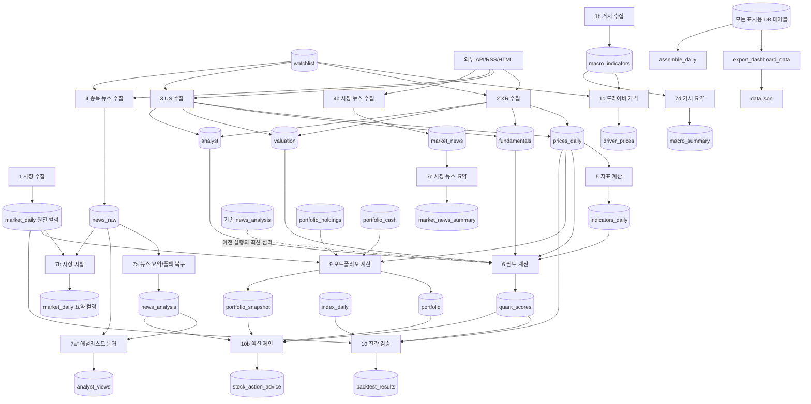

# ATLAS 파이프라인 분리 리팩터링 설계

## 1. 목적과 범위

현재 `src/run_pipeline.py`와 `src/news_refresh.py`에 섞인 수집·분석·LLM 종합·표시 단계를 세 개의 독립 실행 파이프라인으로 나눈다. 이번 작업은 **행위 보존 리팩터링**이며 기능, DB 스키마, JSON 계약, 점수·신호·조언 정책을 바꾸지 않는다.

완료 후 공개 실행 단위는 다음과 같다.

```text
python -m src.pipeline_ingest --profile daily|refresh
python -m src.pipeline_analysis --profile daily|refresh
python -m src.pipeline_synthesis --profile daily|refresh
python -m src.export_dashboard_data
```

`src/run_pipeline.py`는 즉시 삭제하지 않고 세 파이프라인을 기존 순서로 호출한 뒤 `assemble_daily()` 결과를 반환하는 호환 래퍼로 유지한다. 새 오케스트레이션 프레임워크, 설정 프레임워크, 큐, 새 의존성은 도입하지 않는다.

### 변하지 않는 절대 규칙

- 시크릿·계좌정보·토큰은 환경변수 또는 GitHub Secrets에서만 읽고 코드·로그·문서·DB에 남기지 않는다.
- 주문·체결·이체와 외부 주문 API 호출은 만들지 않는다.
- PRD DB/JSON 계약, 종목별 최신 export 조회, DB NUMERIC 읽기 경계의 `float` 변환을 유지한다.
- §F7의 true backtest/retrospective 분리를 유지한다.
- 매력도 3축과 수동 판단 단·중·장 레이어를 단일 점수로 합치지 않는다.
- 신호는 근거·백분위·신뢰도를 동반하고, 액션 제언 숫자는 결정론 코드만 만든다.
- 기존 종목 단위 실패 격리와 단계별 `commit()`/예외 시 `rollback()` 위치를 보존한다.

## 2. 검토한 접근

### A. 얇은 3개 실행기 + 기존 모듈 재사용 — 채택

각 실행기는 기존 단계 함수를 소유하고 DB를 통해서만 다음 파이프라인과 연결된다. `daily`와 `refresh` 두 고정 프로필만 코드 상수로 둔다. 기존 `run_pipeline`은 호환 래퍼로 남겨 커밋 단위 롤백과 전후 비교를 가능하게 한다.

장점은 가장 작은 구조 변경, 독립 재실행, 명확한 DB 경계다. 단점은 전환 기간에 호환 래퍼가 하나 더 남는다는 점이다.

### B. 하나의 CLI에 `ingest|analysis|synthesis` 서브커맨드

파일 수는 줄지만 한 진입점이 다시 모든 모듈을 import하고 프로필 분기를 소유한다. 현재 결합을 이름만 바꿔 보존할 가능성이 높아 채택하지 않는다.

### C. DAG/워크플로 프레임워크 도입

의존성 선언과 재시도 기능은 좋지만 현재 요구에는 새 런타임·설정·운영 복잡도만 늘어난다. 독립 실행과 순서 제어는 Python 모듈과 GitHub Actions로 충분하므로 제외한다.

## 3. 현재 단계별 의존성 맵



### 현재 순서에서 보존해야 할 비직관적 의존성

1. 퀀트 계산은 같은 실행의 Gemini 요약보다 먼저 실행된다. 따라서 sentiment 입력은 **이전까지 저장된 최신 `news_analysis`**다. 종합을 분석보다 먼저 옮기면 결과가 달라지므로 금지한다.
2. `market_daily`는 수집이 숫자·`payload`를 쓰고 종합이 요약 컬럼만 갱신하는 공유 테이블이다. 종합 단계는 현재처럼 요약 컬럼만 `UPDATE`해 `payload.changes`를 보존한다.
3. 액션 제언은 현재 `export_dashboard_data.build_data()`로 DB 읽기 모델을 만든다. `data.json` 파일에는 의존하지 않지만 종합 코드가 표시 모듈을 import하는 역의존이다.
4. `assemble_daily()`는 DB를 읽기만 하고 현재 06시 실행의 반환 계약을 만든다. 새 세 파이프라인의 DB 경계에는 포함하지 않고 호환 래퍼에 남긴다.
5. `portfolio_advice`는 현재 06시/18시 자동 잡이 아니라 로컬 API 또는 직접 실행에서 생성한다. 경계상 종합 파이프라인 소유지만 자동 스케줄에 새로 넣지 않는다.

## 4. 목표 경계

### 4.1 수집 파이프라인

| 항목 | 내용 |
|---|---|
| 진입점 | `src/pipeline_ingest.py` |
| 입력 | 활성 `watchlist`, 외부 데이터 소스, 환경변수의 선택형 API 키 |
| 모듈 | `ingest_market`, `ingest_macro`, `ingest_drivers`, `ingest_kr`, `ingest_us`, `ingest_news`, `ingest_market_news` |
| 출력 테이블 | `market_daily` 원천 숫자/`payload`, `macro_indicators`, `driver_prices`, `prices_daily`, `fundamentals`, `valuation`, `analyst`, `news_raw`, `market_news` |
| 금지 | 지표·점수 계산, LLM 호출, export |

`index_daily`의 5년 백필과 `ticker_drivers` 자동/사용자 매핑은 현재 일일 `run_pipeline` 밖의 별도 운영 경로이므로 이번 자동 프로필에 추가하지 않는다. 경계상 수집 소유라는 사실만 문서화한다.

### 4.2 분석 파이프라인

| 항목 | 내용 |
|---|---|
| 진입점 | `src/pipeline_analysis.py` |
| 입력 테이블 | `watchlist`, `prices_daily`, `fundamentals`, `valuation`, `analyst`, 기존 최신 `news_analysis`, `market_daily`, `index_daily`, `portfolio_holdings`, `portfolio_cash` |
| 모듈 | `compute_indicators`, `compute_quant`, `compute_portfolio`, `backtest`, `strategies` |
| 출력 테이블 | `indicators_daily`, `quant_scores`, `portfolio`, `portfolio_snapshot`, `backtest_results` |
| 금지 | 외부 수집, LLM 호출, 표시 JSON 생성 |

`strategies.py`는 전략 정의만 제공하며 직접 DB를 쓰지 않는다. §F7에 따라 true/retrospective 저장과 UI 경고 계약은 그대로 유지한다.

### 4.3 종합 파이프라인

| 항목 | 내용 |
|---|---|
| 진입점 | `src/pipeline_synthesis.py` |
| 입력 테이블 | `news_raw`, 기존 `news_analysis`, `market_daily`, `market_news`, `macro_indicators`, `ticker_context`, `analyst`, `quant_scores`, `portfolio`, `portfolio_snapshot`, `portfolio_holdings`, 수동 판단/리서치 테이블 |
| 모듈 | `enrich_gemini`, `stock_action_advice`, `portfolio_advice` |
| 출력 테이블 | `news_analysis`, `ticker_context`, `analyst_views`, `market_daily` 요약 컬럼, `market_news_summary`, `macro_summary`, `stock_action_advice`, `portfolio_advice` |
| 금지 | 원천 수집, 지표·팩터·백테스트 계산, 주문 실행 |

액션 제언의 방향·비중·목표 레인지·진입/이탈 구간은 기존 결정론 코드를 그대로 사용한다. LLM은 숫자를 생성하거나 바꾸지 않는다. `portfolio_advice`는 이 경계가 소유하지만 `daily`/`refresh` 자동 프로필에서는 호출하지 않아 현재의 사용자 요청 기반 동작을 보존한다.

### 4.4 표시 읽기 경계

`src/export_dashboard_data.py`는 DB를 읽어 기존 JSON 계약으로 직렬화하고 `data.json`을 쓰는 표시 경계다. 외부 수집, LLM 호출, DB 쓰기를 하지 않는다. 종목별 최신 조회만 사용하고 글로벌 `max(asof)`를 새로 도입하지 않는다.

현재 export에는 표시 신호, 오늘의 요약 밴드, 시장 진입 환경, 전략 가이드 같은 **순수 표시 파생값** 계산이 있다. 이를 모두 DB에 미리 저장하려면 새 테이블/컬럼과 계약 변경이 필요해 행위 보존 범위를 벗어난다. 따라서 이번 리팩터링에서 “계산 안 함”은 **원천/도메인 재계산과 DB 쓰기 없음**으로 한정하고, 기존 순수 표시 파생과 포맷팅은 그대로 둔다. 이를 완전히 영속 계산으로 옮기는 작업은 별도 Wave와 PRD 변경이 있어야 한다.

액션 제언의 `export_dashboard_data.build_data()` 역의존은 단계적으로 제거한다. 액션 제언이 실제로 소비하는 종목·포트폴리오·국면 입력을 `stock_action_advice`의 읽기 함수로 옮기고, 고정 fixture에서 기존 `build_data()` 기반 입력과 완전 동일함을 먼저 검증한다. 그 전까지는 역의존을 유지해 결과 변화보다 이동 속도를 우선하지 않는다.

## 5. 공유 자원 처리

### DB 연결과 실행 로그

- `get_conn`, upsert/insert 함수, `log_run_start`, `log_run_finish`는 계속 `src/db.py`가 단일 소유한다.
- 각 공개 파이프라인 실행은 자기 연결과 `runs` 행을 가진다. `kind`는 `pipeline_ingest`, `pipeline_analysis`, `pipeline_synthesis`로 고정한다.
- 도메인 테이블 비교에서 `runs`는 제외한다. 분리 후 `runs` 행 수·ID·시각이 달라지는 것은 의도된 운영 관측 변화이며, 각 파이프라인의 `success|partial|failed`와 `errors` 형식은 별도 테스트한다.
- 기존처럼 부분 실패는 다음 종목/단계로 진행한다. `success`와 `partial`은 CLI 종료코드 0, DB 연결·유니버스 로드 같은 파이프라인 전체 실패만 종료코드 1로 한다.

### 최소 공유 코드

`src/pipeline_common.py`에는 다음 두 종류만 둔다.

- 활성 유니버스 조회와 KR/US 분리
- 기존 오류 dict 생성 및 실행 상태 확정

DI 컨테이너, 추상 base pipeline, step registry class는 만들지 않는다. 단계 순서는 각 실행기의 짧은 튜플 상수로 보이게 둔다.

### 시크릿과 모델 상수

- 시크릿 이름과 로딩 경로는 바꾸지 않는다. 파이프라인 실행기는 값을 읽거나 출력하지 않고 소유 모듈에 전달한다.
- Gemini 기본 모델·HTTP timeout·배치 예산 상수는 계속 `enrich_gemini.py`가 소유하고 환경변수로 덮어쓴다.
- GitHub Actions의 모델명과 timeout 환경변수는 현재 값을 그대로 전달한다.
- 이번 리팩터링에서 별도 `config.py`, YAML 설정, 시크릿 래퍼를 만들지 않는다.

## 6. 독립 실행 진입점과 프로필

각 모듈은 `run(profile: str, asof: date | None = None) -> dict`와 `main() -> int`를 제공한다. 반환 dict는 `status`, `errors`, `counts`만 가진다. 허용 프로필은 코드 상수 `daily`, `refresh` 두 개뿐이며 잘못된 값은 실행 전에 종료코드 2로 거절한다.

| 프로필 | 수집 | 분석 | 종합 |
|---|---|---|---|
| `daily` | 시장, 거시, 드라이버 가격, KR/US 가격·재무·밸류·컨센서스, 종목/시장 뉴스 | 지표, 퀀트, 포트폴리오 평가, true/retrospective 전략 검증 | 뉴스 요약, 폴백 복구, 애널리스트 논거, 시장 시황, 시장 뉴스 요약, 거시 요약, 액션 제언 |
| `refresh` | 현재 18시와 동일한 전 종목 경량 가격, 종목 뉴스, 시장 뉴스 | 지표, 퀀트 | 뉴스 요약, 시장 시황, 시장 뉴스 요약 |

독립 실행은 “필요한 원천이 DB에 이미 있다”는 조건으로 동작한다. freshness가 부족해도 새로 수집하거나 강제로 중단하지 않고 현재처럼 가능한 결과를 만들고 오류/결측을 기록한다. 분석만 재실행할 때 LLM과 네트워크 수집을 호출하지 않으며, 종합만 재실행할 때 지표·퀀트·백테스트를 다시 계산하지 않는다.

## 7. 06시/18시 CI 호출 순서

### 06:00 KST — 현재 전체 실행 보존

```yaml
- run: python -m src.pipeline_ingest --profile daily
- run: python -m src.pipeline_analysis --profile daily
- run: python -m src.pipeline_synthesis --profile daily
```

분석을 종합보다 먼저 실행해 현재의 “이전 최신 뉴스 심리로 퀀트 계산” 행위를 보존한다. 현재 06시 CI는 `data.json`을 만들지 않으며 CI 산출물도 저장하지 않으므로 export를 새로 추가하지 않는다. 로컬 화면은 기존 `start_dashboard.sh`에서 export한다.

### 18:00 KST — 현재 경량 갱신 보존

```yaml
- run: python -m src.pipeline_ingest --profile refresh
- run: python -m src.pipeline_analysis --profile refresh
- run: python -m src.pipeline_synthesis --profile refresh
- run: python -m src.export_dashboard_data
```

18시 `refresh`는 현재처럼 재무·밸류·컨센서스, 포트폴리오, 백테스트, 폴백 복구, 애널리스트 논거, 거시 요약, 액션 제언을 실행하지 않는다. export 산출물이 CI에서 폐기되는 현재 운영도 우선 그대로 보존하며, 제거 여부는 별도 운영 변경으로 다룬다.

GitHub Actions는 네 명령을 한 step에 묶지 않고 step별로 둔다. 어느 파이프라인이 실패했는지 UI에서 즉시 보이게 하되, `partial`은 종료코드 0이라 다음 파이프라인이 계속 실행된다.

## 8. 행위 보존 보장 전략

### 비교 기준 고정

- 기준 커밋: 리팩터링 시작 시의 `main` SHA를 기록한다.
- 외부 API와 LLM은 전후 비교에서 호출하지 않는다. 반환값과 현재 시간을 고정 fixture/monkeypatch로 통제한다.
- 동일 seed DB를 두 개의 격리된 스키마 또는 임시 DB에 복제해 legacy와 신규 경로를 각각 실행한다. 운영 DB에서 비교 실행하지 않는다.

### DB 스냅샷 비교

파이프라인별 출력 테이블을 기본키 순으로 읽어 canonical JSON으로 만든 뒤 완전 비교한다.

- 수집: `market_daily`, `macro_indicators`, `driver_prices`, `prices_daily`, `fundamentals`, `valuation`, `analyst`, `news_raw`, `market_news`
- 분석: `indicators_daily`, `quant_scores`, `portfolio`, `portfolio_snapshot`, `backtest_results`
- 종합: `news_analysis`, `ticker_context`, `analyst_views`, `market_daily` 요약 컬럼, `market_news_summary`, `macro_summary`, `stock_action_advice`, 필요 시 `portfolio_advice`

비교 전 `Decimal`은 문자열 또는 동일 정밀도의 숫자로 정규화하고 JSON key와 행 순서를 정렬한다. `created_at`, `generated_at`, `run_id`, 실행 시각처럼 본질적으로 변하는 필드만 명시 목록으로 제외한다. `asof`, 모델명, 방향, 점수, 근거, 신뢰도, 이력 순서는 제외하지 않는다.

### export 골든 비교

같은 DB 스냅샷에서 legacy/new `build_data()` 결과를 생성하고 `generatedAt`, `generatedAtLabel`만 고정 또는 정규화한 뒤 깊은 동등 비교한다. 특히 다음을 별도 assert한다.

- 종목 수와 ticker 집합
- 종목별 최신 가격·지표·valuation·analyst·quant의 `asof`
- `actionAdviceLatest`와 `actionAdviceHistory` 순서
- 표시 신호의 label/percentile/reason/confidence
- §F7 true/retrospective 구분과 경고 데이터
- 매력도 3축 및 수동 단·중·장 레이어가 합산되지 않음
- UI 문자열에 내부 경로와 `.py` 이름이 없음

### 회귀 테스트 게이트

각 단계 커밋 전후에 아래를 모두 실행한다.

```bash
.venv/bin/python -m pytest -q
npm --prefix dashboard-web test
npm --prefix dashboard-web run build
```

인수인계의 “404개”는 고정 숫자로 하드코딩하지 않는다. 현재 기준 커밋에서 실제 수집된 테스트 수를 기준선으로 기록하고, 테스트 삭제·수집 누락은 실패로 처리한다. 설계 작성 시 로컬에서는 Python **431개**, Node **18개**가 통과했으므로 구현 시작 때 기준 SHA와 두 개수를 다시 기록해 불일치를 먼저 해소한다.

## 9. 단계적 이동과 커밋 경계

각 단계는 한 커밋이며 전체 테스트·프론트 테스트·빌드가 모두 통과해야 다음 단계로 간다.

1. **행위 고정 테스트 추가**
   현재 `run_pipeline`/`news_refresh`의 단계 순서, 프로필별 포함 단계, commit/rollback, DB/export 골든 스냅샷을 먼저 고정한다. 프로덕션 코드는 바꾸지 않는다.

2. **공유 최소 헬퍼와 수집 실행기 추가**
   `pipeline_common.py`, `pipeline_ingest.py`를 추가하되 기존 수집 단계 구현을 그대로 호출한다. legacy/new 수집 스냅샷이 같아야 한다. 기존 CI는 아직 바꾸지 않는다.

3. **분석 실행기 추가**
   지표→퀀트→포트폴리오→백테스트 순서를 `pipeline_analysis.py`로 이동한다. `refresh`는 지표→퀀트만 실행한다. §F7 및 DB NUMERIC 경계 테스트를 함께 통과한다.

4. **종합 실행기 추가**
   현재 Step 7과 액션 제언을 `pipeline_synthesis.py`로 이동한다. `daily`/`refresh` 차이를 고정하고 LLM은 모두 mock으로 검증한다. 액션 숫자 불변·예산 이월 `runs.errors` 기록을 비교한다.

5. **액션 제언의 표시 모듈 역의존 제거**
   기존 `build_data()` 기반 입력과 완전히 같은 최소 입력 읽기 함수를 `stock_action_advice`에 둔다. 골든 fixture가 먼저 실패하는 것을 확인한 뒤 import만 교체한다. JSON/DB 결과가 다르면 이 단계는 롤백한다.

6. **호환 래퍼 전환**
   `run_pipeline.py`는 새 세 실행기를 기존 `daily` 순서로 호출하고 마지막에 `assemble_daily()`를 실행한다. 기존 import 경로와 반환형을 유지한다. `news_refresh.py`도 새 `refresh` 실행기를 호출하는 얇은 호환 래퍼로 남긴다.

7. **CI 진입점 전환**
   06시와 18시 workflow를 §7 순서로 바꾼다. 기존과 새 경로를 같은 스케줄에서 동시에 실행하지 않는다. workflow timeout과 Gemini 환경변수 값은 유지한다.

8. **최종 dead code 제거**
   새 진입점이 안정화된 뒤에만 중복된 private step 함수를 삭제한다. `run_pipeline`/`news_refresh` 호환 래퍼 자체는 다음 Wave 전까지 유지한다.

## 10. 리스크와 롤백 지점

| 리스크 | 방지책 | 롤백 지점 |
|---|---|---|
| 분석/종합 순서 변경으로 quant sentiment가 달라짐 | 06/18 모두 분석→종합 고정, fixture로 이전 `news_analysis` 사용 확인 | 분석 또는 CI 전환 커밋 revert |
| 같은 테이블의 수집/종합 쓰기 충돌 | `market_daily` 숫자·payload와 요약 컬럼 소유권 분리, 기존 UPDATE SQL 보존 | 종합 실행기 커밋 revert |
| commit 범위가 커져 앞 단계 저장이 유실됨 | 기존 종목별/단계별 commit 위치를 테스트로 고정 | 해당 파이프라인 이동 커밋 revert |
| partial이 CI 실패로 바뀌어 후속 단계 미실행 | partial=0, fatal=1 종료코드 계약 테스트 | CI 전환 커밋 revert |
| 새·구 경로 중복 실행 | workflow 전환은 한 커밋, legacy/new 동시 schedule 금지 | workflow 커밋 revert |
| 액션 제언 입력이 export와 달라짐 | 입력 fixture와 최종 `stock_action_advice` 스냅샷 완전 비교 | 역의존 제거 커밋만 revert |
| export 최신 행 조회 회귀 | ticker별 asof 불일치 fixture 유지, 글로벌 max(asof) 금지 테스트 | 표시 경계 커밋 revert |
| 시크릿이 오류 문자열에 노출 | 기존 마스킹 테스트와 환경변수명만 사용하는 runner 유지 | 노출 발생 커밋 즉시 revert |
| 테스트 수 감소가 통과로 오인됨 | 기준 SHA의 수집 개수 기록, 테스트 삭제/누락 금지 | 해당 단계 커밋 revert |
| `asof`/오늘 날짜 의미를 리팩터링 중 수정 | 현재 날짜 사용 방식을 그대로 보존하고 별도 버그 수정으로 분리 | 날짜 관련 변경 제외/revert |

롤백은 DB migration을 요구하지 않는다. 이번 설계는 스키마를 바꾸지 않으므로 각 단계는 코드 커밋 revert만으로 이전 실행기로 돌아갈 수 있다. 새 파이프라인이 일부 행을 이미 upsert했더라도 동일 계약·동일 키·동일 계산 결과여야 하므로 데이터 복구 작업이 필요하지 않아야 한다. 스냅샷 차이가 생기면 CI 전환 전에 중단한다.

## 11. 수용 기준

- 세 파이프라인이 각각 `python -m`으로 독립 실행된다.
- `daily`와 `refresh`가 현재 06시/18시 포함 단계와 순서를 그대로 재현한다.
- 한 파이프라인 재실행이 다른 두 파이프라인의 외부 호출이나 계산을 암묵적으로 실행하지 않는다.
- DB 도메인 테이블과 정규화된 export JSON이 기준 커밋과 동일하다.
- 기존 전체 테스트, 프론트 테스트, 빌드가 각 단계 커밋에서 통과하고 테스트 수가 줄지 않는다.
- 시크릿, 자동 주문, 데이터 계약, 종목별 최신 export, §F7, 3축/판단 레이어 비합산, 액션 제언 숫자 가드가 모두 유지된다.
- 구현 완료 전 `run_pipeline.py`와 `news_refresh.py` 호환 경로가 남아 커밋 단위 롤백이 가능하다.
